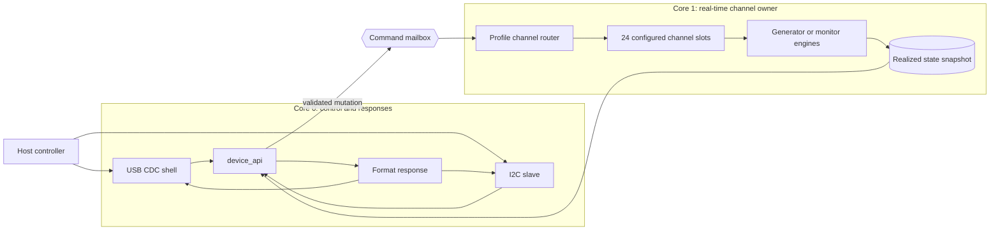
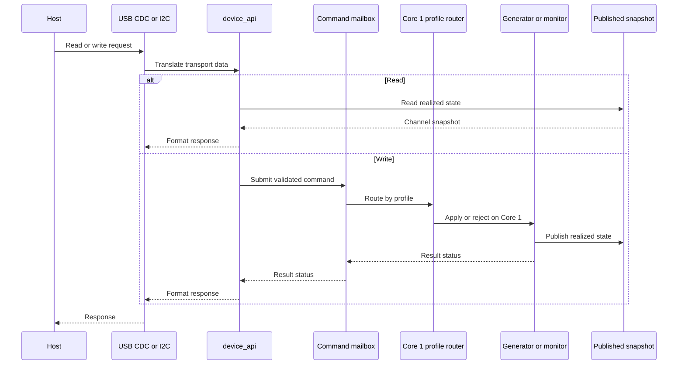
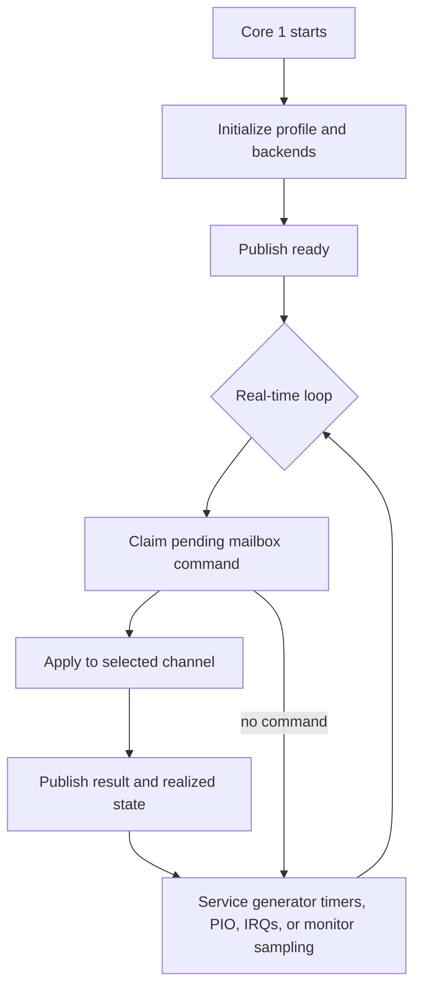
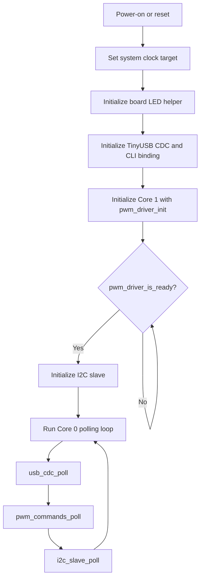

# Architecture

This page describes the current PicoPWM runtime structure. It focuses on module ownership and request flow, not backend implementation detail.

For mailbox state machines, publication internals, and backend-specific behavior, see [detail/pwm_driver_design.md](detail/pwm_driver_design.md).

## At A Glance

The firmware has two deliberately different responsibilities:

- **Core 0** owns control requests and responses for both USB CDC and I2C.
- **Core 1** owns real-time work for every configured channel, whether that
  channel is a PWM generator or a PWM monitor.

The cores communicate through a small command mailbox and a published state
snapshot. Host transports never call generator or monitor backends directly.

Reads use the snapshot directly. Writes enter the mailbox, are applied by
Core 1, and return a result after the selected channel backend accepts or
rejects the request.

## Architecture Documents

Use the architecture-related pages as follows:

- [Architecture](architecture.md) — system structure, layer boundaries, and request flow
- [Firmware Configuration](configuration.md) — startup bank configuration, channel tables, and capability rules
- [Pinout](pinout.md) — physical PWM, I2C, and shared-pin mapping
- [PWM Driver Design](detail/pwm_driver_design.md) — detailed `pwmdriver` and backend internals
- [Hardware PWM Generator](detail/generator/hardware_generator.md) — hardware output timing and slice constraints
- [PIO PWM Generator](detail/generator/pio_generator.md) — PIO output timing and state-machine constraints
- [Software PWM Generator](detail/generator/software_generator.md) — shared timer output generation
- [Hardware PWM Monitor](detail/monitor/hardware_monitor.md) — GPIO interrupt measurement limits
- [PIO PWM Monitor](detail/monitor/pio_monitor.md) — one-period high/low measurement
- [Software PWM Monitor](detail/monitor/software_monitor.md) — low-frequency polling/edge measurement

## System Model

PicoPWM targets Raspberry Pi Pico (RP2040) and Pico 2 (RP2350) with one shared
logical channel model. Startup bank configuration selects whether the fixed hardware,
PIO, and software banks act as PWM generators or PWM monitors.

The host-visible channel IDs and command syntax remain stable across profiles.
The PWM driver configuration, not the CLI, defines each channel's backend, direction,
GPIO, limits, and supported operations. The current default profiles expose 24
channels through this table.

Each logical channel exposes the same readback model:

- `freq_hz`
- `duty`
- `pulse_count`

The field has backend-specific semantics: GPIO monitors count accepted
edge-reconstructed periods, the PIO monitor reports `0` because it captures one
period per sample without accumulating periods, and PIO generator readback may
estimate elapsed periods from its last published reference timestamp.

### Monitor Measurement Strategy

The monitor design is intentionally optimized for occasional latest-value
measurements, not waveform history or trend analysis. A host read needs one
usable frequency/duty result at a time; configuration changes and measured
signal changes are not expected to arrive at a rate that requires continuous
capture.

The three monitor banks therefore use different mechanisms according to their
hardware envelope:

- The hardware and software banks use GPIO edge interrupts with software
    timestamps. They are simple and suitable for their low-frequency ranges.
- The PIO bank captures one complete high/low period in PIO, reads the two FIFO
    words directly, and stops the state machine.

Continuous PIO capture through DMA was considered, but rejected for this
product. DMA would reduce CPU involvement while continuously draining the
FIFO, but the firmware would still retain only one latest sample. It would add
DMA-channel allocation, buffer-coherence handling, transfer-lifetime behavior,
and recovery paths without providing history or a better user-visible result.

CPU GPIO polling was rejected because it spends CPU time waiting and becomes
less reliable as frequency increases. GPIO edge interrupts remain appropriate
for the slower banks. PWM-slice input capture was rejected because it would
couple measurement to PWM slice routing and complicate the fixed bank model.

PIO one-period capture is the resulting compromise: PIO provides accurate
high/low timing for a complete period, while direct FIFO reads keep resource
ownership and runtime behavior small. If the product later requires continuous
high-rate capture, trend analysis, or waveform history, DMA or a dedicated
buffered capture design should be reconsidered as a new requirement rather than
added preemptively.

The hardware PWM bank intentionally uses PWM slice channel B pins so the external pin order stays aligned with the monitoring-oriented wiring plan. See [Pinout](pinout.md) for the physical mapping.

## Runtime Layers

The current firmware is split into four practical layers. The important rule is
that transport code reaches PWM hardware only through `device_api` and
`pwm_driver`.

### 1. Transport Layer

Core 0 owns the host-facing transports:

- `usb/usb_cdc.*` for TinyUSB CDC byte transport
- `cli/shell.*` for the microrl-backed line editor and command dispatch
- `cli/pwm_commands.*` for human-readable CLI commands
- `i2c/i2c_slave.*` for the I2C slave ISR and deferred write scheduling
- `i2c/i2c_control_map.*` for the I2C register map and payload translation

USB CDC uses bounded 128-byte receive and 256-byte transmit queues. When a
queue is full, additional received bytes or transmit responses are dropped and
the transport reports failure where the API permits it. This fixed-resource
policy prevents unbounded memory growth; applications requiring reliable bulk
transfer must provide host-side pacing and retry at the command level.

### 2. Shared Control Layer

`device_api/device_api.*` is the transport-neutral Core 0 API shared by USB CDC and I2C.

Responsibilities:

- expose device info and firmware version
- return realized channel state
- translate channel updates into the shared PWM command path
- avoid introducing a second shadow cache above `pwmdriver`

### 3. Multicore Boundary Layer

`pwmdriver/pwm_driver.*` is the architectural boundary between Core 0 command ingress and Core 1 backend ownership.

Responsibilities:

- accept validated logical channel writes from Core 0
- serialize public writes before mailbox submission
- forward one admitted command across the multicore mailbox
- publish realized state snapshots for Core 0 readers

### 4. Configuration and Backend Layer

The PWM driver configuration owns the logical channel table and capability
validation. Core 1 then dispatches each configured channel to its selected
backend.

Core 1 owns the backend implementations:

- `pwmdriver/generator/hardware_generator.*` and `pwmdriver/monitor/hardware_monitor.*`
- `pwmdriver/generator/pio_generator.*` and `pwmdriver/monitor/pio_monitor.*`
- `pwmdriver/generator/software_generator.*` and `pwmdriver/monitor/software_monitor.*`

These modules own hardware configuration, IRQ or timer paths, and backend-local state.

## Core Ownership

### Core 0

Core 0 owns:

- USB CDC polling
- CLI command parsing and formatting
- I2C transport framing
- I2C deferred command execution
- shared control/status translation
- top-level startup sequencing

### Core 1

Core 1 owns:

- backend initialization
- PWM hardware and PIO state
- software PWM timer callbacks
- PWM-related IRQ handling
- publication of realized channel state

Core 0 must not call backend driver APIs directly.

## Request Flow

USB and I2C converge at the same Core 0 control facade. Reads are answered
from the published snapshot; mutations cross the mailbox boundary:

Transport-specific details:

- I2C reads can be served directly from the published snapshot or last command status.
- I2C writes are captured in the ISR, deferred into normal Core 0 polling, and then executed through the same shared control path used by USB CDC.
- USB commands are parsed by `shell` and the CLI command handlers before they reach `device_api`.
- I2C commands are decoded by `i2c_slave` and `i2c_control_map` before they reach `device_api`.

This keeps the ISR transport-focused and avoids running backend-affecting logic in interrupt context.

## Core 1 Real-Time Loop

Core 1 does not wait for host traffic to manage channels. It initializes the
selected profile, services the command mailbox, and continuously services the
configured generator or monitor backends.

The mailbox is for control mutations and command results, not for streaming
every PWM edge. High-rate timing and measurement stay local to Core 1; Core 0
sees coherent realized snapshots.

## Cross-Core Mutation Boundary

`device_api` is the only public Core 0 mutation facade.

- Core 0 transport code enters through `device_api`.
- `device_api` forwards writes into the internal `pwmdriver` mailbox API.
- Core 1 applies the write to the selected backend.
- Core 1 publishes the realized state after successful apply.
- Core 0 waits for the result and reports `ok`, `busy`, `invalid`, `timeout`, `unavailable`, or `apply failed` to the caller.

The internal `pwmdriver` mailbox API is not part of the transport-facing interface.

## Shared State Model

The single source of truth for channel state is the snapshot published by `pwmdriver`.

That means:

- reads report realized backend state, not just the last requested values
- `device_api` does not keep a second cache
- both USB CDC and I2C observe the same logical channel view

`pulse_count` is monotonic from power-on. `stop` disables generator outputs by driving them low (`freq = 0 Hz`, `duty = 0%`) and does not reset the counter. Hardware and PIO generators estimate that count from elapsed time and the realized frequency. Software generators count completed periods. PIO monitor channels report `0` because they capture one period per sample.

## Channel Layout

Logical IDs are configuration-defined and stable for host software. The
current default profile exposes `0..23`; backend ownership and GPIO assignment
must be read from the selected profile rather than inferred from an ID range.
See [Firmware Configuration](configuration.md) and [Pinout](pinout.md).

## Startup Sequence

The startup order matters because Core 0 must not accept host commands before
Core 1 has initialized the PWM ownership boundary.

In ordered form:

1. Core 0 raises the system clock target to 150 MHz when possible.
2. Core 0 initializes the board LED helper.
3. Core 0 initializes TinyUSB CDC and the CLI transport binding.
4. Core 0 initializes and launches Core 1 with `pwm_driver_init(config)`.
5. Core 0 waits for `pwm_driver_is_ready()`.
6. Core 0 initializes the I2C slave transport.
7. The main loop services `usb_cdc_poll()`, `pwm_commands_poll()`, and `i2c_slave_poll()`.

When the USB CDC host opens the connection, the CLI prints help once through `pwm_commands_on_connected()`.

## Where To Read Next

- [Control Interfaces](control/README.md) for shared semantics and transport links
- [I2C Protocol](control/i2c_protocol.md) for binary register values
- Source headers under `firmware/src` for current C declarations and APIs
- [PWM Driver Design](detail/pwm_driver_design.md) for backend and mailbox internals
