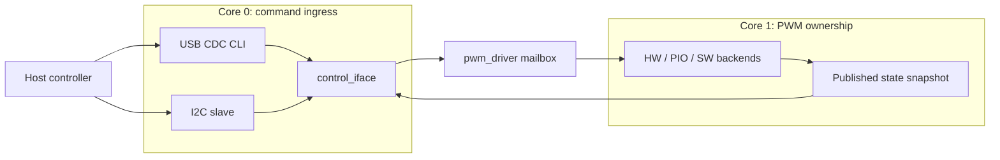
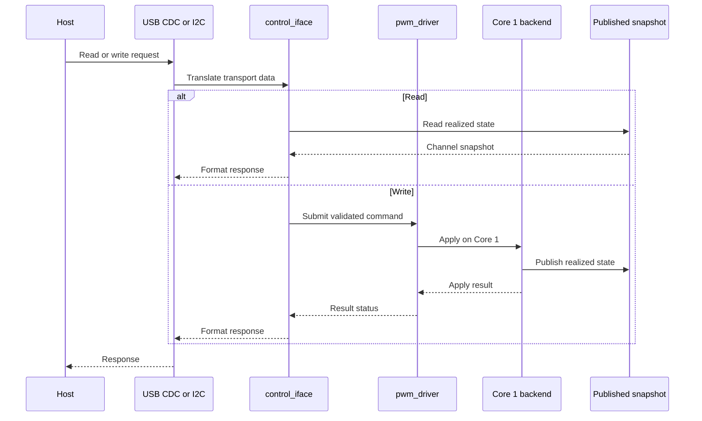
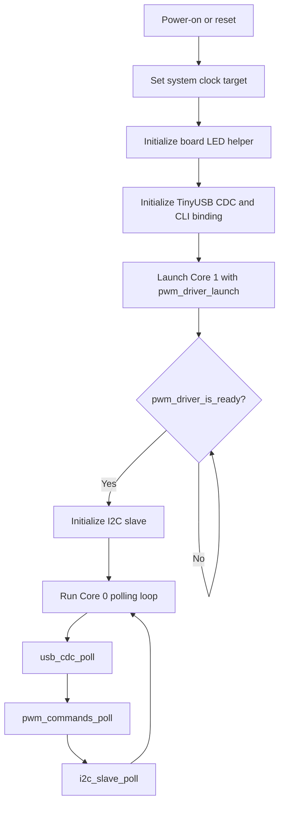

# Architecture

This page describes the current PicoPWM runtime structure. It focuses on module ownership and request flow, not backend implementation detail.

For mailbox state machines, publication internals, and backend-specific behavior, see [detail/pwm_driver_design.md](detail/pwm_driver_design.md).

## At A Glance

The runtime has one command path on Core 0, one multicore boundary, and one
backend owner on Core 1. Both host transports read the same published state.

## Architecture Documents

Use the architecture-related pages as follows:

- [Architecture](architecture.md) — system structure, layer boundaries, and request flow
- [Firmware Configuration](configuration.md) — build profiles, channel tables, and capability rules
- [Firmware Interfaces](firmware_interfaces.md) — source-level interface reference for the current modules
- [Pinout](pinout.md) — physical PWM, I2C, and shared-pin mapping
- [PWM Driver Design](detail/pwm_driver_design.md) — detailed `pwmdriver` and backend internals
- [Hardware PWM Design](detail/hw_pwm_design.md) — hardware generator and monitor design, limits, and target range
- [Software PWM Design](detail/sw_pwm_design.md) — software generator and monitor design, limits, and standalone monitor role

## System Model

PicoPWM targets Raspberry Pi Pico (RP2040) and Pico 2 (RP2350) with one shared
logical channel model. Build configuration selects whether those channels act
as PWM generators, PWM monitors, or a project-specific combination of
supported channel backends.

The host-visible channel IDs and command syntax remain stable across profiles.
The channel table, not the CLI, defines each channel's backend, direction,
GPIO, limits, and supported operations. The current firmware still uses the
legacy 24-channel generator mapping internally; that mapping is the default
profile to migrate into the configuration table.

Each logical channel exposes the same readback model:

- `freq_hz`
- `duty`
- `pulse_count`

The hardware PWM bank intentionally uses PWM slice channel B pins so the external pin order stays aligned with the monitoring-oriented wiring plan. See [Pinout](pinout.md) for the physical mapping.

## Runtime Layers

The current firmware is split into four practical layers. The important rule is
that transport code reaches PWM hardware only through `control_iface` and
`pwm_driver`.

### 1. Transport Layer

Core 0 owns the host-facing transports:

- `usb/usb_cdc.*` for TinyUSB CDC byte transport
- `cli/shell.*` for the microrl-backed line editor and command dispatch
- `cli/pwm_commands.*` for human-readable CLI commands
- `i2c/i2c_slave.*` for the I2C slave ISR and deferred write scheduling
- `i2c/i2c_control_map.*` for the I2C register map and payload translation

### 2. Shared Control Layer

`control/control_iface.*` is the transport-neutral Core 0 API shared by USB CDC and I2C.

Responsibilities:

- expose device info and firmware version
- return realized channel state
- translate channel updates into the shared PWM command path
- avoid introducing a second shadow cache above `pwmdriver`

### 3. Multicore Boundary Layer

`pwmdriver/pwm_driver.*` is the architectural boundary between Core 0 command ingress and Core 1 backend ownership.

Responsibilities:

- accept validated logical channel writes from Core 0
- serialize public writes before mailbox submission
- forward one admitted command across the multicore mailbox
- publish realized state snapshots for Core 0 readers

### 4. Configuration and Backend Layer

The profile configuration owns the logical channel table and capability
validation. Core 1 then dispatches each configured channel to its selected
backend.

Core 1 owns the backend implementations:

- `pwmdriver/hw_pwm_driver.*`
- `pwmdriver/pio/generator.*`
- `pwmdriver/sw_pwm_driver.*`
- monitor backends for configured input channels

These modules own hardware configuration, IRQ or timer paths, and backend-local state.

## Core Ownership

### Core 0

Core 0 owns:

- USB CDC polling
- CLI command parsing and formatting
- I2C transport framing
- I2C deferred command execution
- shared control/status translation
- top-level startup sequencing

### Core 1

Core 1 owns:

- backend initialization
- PWM hardware and PIO state
- software PWM timer callbacks
- PWM-related IRQ handling
- publication of realized channel state

Core 0 must not call backend driver APIs directly.

## Request Flow

USB and I2C converge at the same Core 0 control facade and then cross the same
mailbox boundary:

Transport-specific details:

- I2C reads can be served directly from the published snapshot or last command status.
- I2C writes are captured in the ISR, deferred into normal Core 0 polling, and then executed through the same shared control path used by USB CDC.
- USB commands are parsed by `shell` and the CLI command handlers before they reach `control_iface`.
- I2C commands are decoded by `i2c_slave` and `i2c_control_map` before they reach `control_iface`.

This keeps the ISR transport-focused and avoids running backend-affecting logic in interrupt context.

## Cross-Core Mutation Boundary

`control_iface` is the only public Core 0 mutation facade.

- Core 0 transport code enters through `control_iface`.
- `control_iface` forwards writes into the internal `pwmdriver` mailbox API.
- Core 1 applies the write to the selected backend.
- Core 1 publishes the realized state after successful apply.
- Core 0 waits for the result and reports `ok`, `busy`, `invalid`, `timeout`, `unavailable`, or `apply failed` to the caller.

The internal `pwmdriver` mailbox API is not part of the transport-facing interface.

## Shared State Model

The single source of truth for channel state is the snapshot published by `pwmdriver`.

That means:

- reads report realized backend state, not just the last requested values
- `control_iface` does not keep a second cache
- both USB CDC and I2C observe the same logical channel view

`pulse_count` is monotonic from power-on. `stop` disables output by restoring `freq = 0 Hz` and `duty = 50%`, but it does not reset the counter. For PIO channels, the count is estimated from elapsed time and realized frequency rather than hardware-counted per pulse.

## Channel Layout

Logical IDs are configuration-defined and stable for host software. The
current default profile exposes `0..23`; backend ownership and GPIO assignment
must be read from the selected profile rather than inferred from an ID range.
See [Firmware Configuration](configuration.md) and [Pinout](pinout.md).

## Startup Sequence

The startup order matters because Core 0 must not accept host commands before
Core 1 has initialized the PWM ownership boundary.

In ordered form:

1. Core 0 raises the system clock target to 150 MHz when possible.
2. Core 0 initializes the board LED helper.
3. Core 0 initializes TinyUSB CDC and the CLI transport binding.
4. Core 0 launches Core 1 with `pwm_driver_launch()`.
5. Core 0 waits for `pwm_driver_is_ready()`.
6. Core 0 initializes the I2C slave transport.
7. The main loop services `usb_cdc_poll()`, `pwm_commands_poll()`, and `i2c_slave_poll()`.

When the USB CDC host opens the connection, the CLI prints help once through `pwm_commands_on_connected()`.

## Where To Read Next

- [Control Protocol](protocol.md) for command syntax and I2C register values
- [Firmware Interfaces](firmware_interfaces.md) for the source-level interfaces
- [PWM Driver Design](detail/pwm_driver_design.md) for backend and mailbox internals
