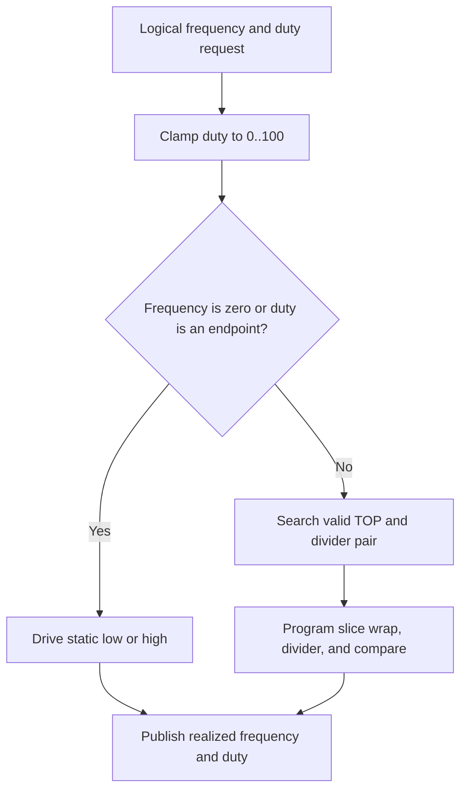

# Hardware PWM Generator Design

This document describes the current hardware PWM design under `firmware/src/pwmdriver/generator/`.

This page covers the hardware PWM generator backend. The matching monitor
design is documented in [Hardware PWM Monitor](../monitor/hardware_monitor.md).

This page is implementation-oriented and reflects the current source tree.

## Source Layout

| File | Responsibility |
| ------ | ---------------- |
| `firmware/src/pwmdriver/generator/hardware_generator.c` | Hardware PWM generator backend implementation |
| `firmware/src/pwmdriver/generator/hardware_generator.h` | Hardware PWM generator backend interface |

## Channel Model

The hardware PWM bank uses logical channels `0..7` in the unified driver model.
The physical GPIO and slice mapping is documented in [Pinout](../pinout.md).
The design intentionally uses slice-B pins so the physical channel order stays
aligned with the measurement-oriented wiring plan.

### Resource and Pin Constraints

The hardware backend is constrained by the MCU PWM peripheral:

- one backend channel requires a valid PWM-capable GPIO and slice/channel
    assignment
- the default profile is fixed to eight slice-B GPIOs: GPIO `1, 3, 5, 7, 9, 11,
    13, 15`; this is one fixed pin set, not a free choice among compatible
    slice/channel pins
- the hardware channel count is fixed at 8 (one per RP2040 PWM slice) and is
    not expandable by selecting a different GPIO
- the backend has a nonzero minimum frequency derived from its maximum divider
    and 16-bit period counter

These are profile constraints, not assumptions the host CLI should infer from
the logical channel number.

## Generator Design

### Intent

The hardware generator backend is the highest-accuracy PWM generator in the current firmware.

The public logical state uses:

- `freq_hz` as `uint32_t`
- `duty` as integer percent `0..100`
- `pulse_count` as the elapsed-time period count

`pulse_count` is the period count this backend publishes. The hardware PWM slice does not keep a host-readable edge counter, and the generator does not take a wrap interrupt: one interrupt per period would spend Core 1 time at the frequencies this backend is meant to run. The backend freezes the count when the realized frequency changes, and Core 0 adds whole periods from the elapsed time and that frequency on read. A static output (`freq_hz = 0`) stops the count. `stop` drives the pin low and does not clear it. The count is monotonic and saturates at `UINT32_MAX`.

The generator treats `freq_hz = 0` as a static-output policy case:

- `freq_hz = 0`, `duty = 100` means static high
- `freq_hz = 0`, any other duty means static low

Nonzero-frequency endpoint duties also resolve directly to static levels:

- `duty = 0` means static low
- `duty = 100` means static high

### Generator Decision Flow

### Timing Model

The hardware PWM block uses:

- a 16-bit wrap counter, so `TOP + 1` can range from `2` to `65536`
- a fractional clock divider from `1.0` to `255 + 15/16`
- one independent PWM slice per logical channel

The realized PWM frequency is:

$$
f_{pwm} = \frac{f_{sys}}{clkdiv \cdot (TOP + 1)}
$$

In the current implementation the divider is searched in sixteenth-step units:

$$
clkdiv = \frac{div\_x16}{16}
$$

The practical low-end limit comes from the combination of the largest divider and the 16-bit counter:

$$
f_{min} = \left\lceil \frac{f_{sys} \cdot 16}{4095 \cdot 65536} \right\rceil
$$

The theoretical high-end limit comes from the smallest divider and the minimum valid period count of `2`:

$$
f_{max} = \frac{f_{sys}}{2}
$$

### Current Clock Plan and Supported Envelope

The current firmware startup attempts to run `clk_sys` at `150 MHz` and may fall back to `125 MHz` if that clock plan is not accepted by the board.

Some board-level helper paths in this repository also show a `200 MHz` clock plan, so it is useful to show that case as a reference point too.

That gives the following hardware-generator envelope:

| `clk_sys` | Counter-limited minimum | Counter-limited maximum |
|-----------|-------------------------|-------------------------|
| `200 MHz` | about `12 Hz` | `100 MHz` |
| `150 MHz` | about `9 Hz` | `75 MHz` |
| `125 MHz` | about `8 Hz` | `62.5 MHz` |

These are hardware representability limits, not the recommended operating range.

### Target Working Range

The recommended working range for the hardware PWM generator is:

- about `10 Hz .. 1 MHz`

That target range is narrower than the raw hardware envelope for two reasons:

1. The low end should stay above the worst-case counter-and-divider floor even when the startup clock falls back from `150 MHz` to `125 MHz`.
2. The high end should keep enough counter counts per period to preserve useful duty-cycle resolution.

At the top of the recommended range, with `clkdiv = 1`:

- `1 MHz` gives about `200` counts per period at `200 MHz`
- `1 MHz` gives about `150` counts per period at `150 MHz` and about `125` counts per period at `125 MHz`
- that corresponds to duty steps of about `0.5%`, `0.67%`, or `0.8%`, which is still practical

Above that range the backend can still generate outputs, but duty granularity degrades quickly because the 16-bit counter is no longer the limiting factor; the number of available counts per period collapses as frequency rises.

Examples with `clkdiv = 1`:

| Frequency | Counts per period at `150 MHz` | Approximate duty step |
| ----------- | -------------------------------- | ----------------------- |
| `1 MHz` | `150` | `0.67%` |
| `5 MHz` | `30` | `3.3%` |
| `10 MHz` | `15` | `6.7%` |
| `20 MHz` | about `8` | `12.5%` |

For a `200 MHz` reference point with `clkdiv = 1`:

| Frequency | Counts per period at `200 MHz` | Approximate duty step |
| ----------- | -------------------------------- | ----------------------- |
| `1 MHz` | `200` | `0.5%` |
| `5 MHz` | `40` | `2.5%` |
| `10 MHz` | `20` | `5%` |
| `20 MHz` | `10` | `10%` |

For that reason, frequencies above about `1 MHz` are better treated as possible-but-not-targeted outputs rather than as the normal operating range.

### Generator Workflow

The current generator workflow is:

1. accept one logical request in integer `freq_hz` and integer duty percent
2. clamp duty into `0..100`
3. resolve static outputs first for `freq_hz = 0` and endpoint duties
4. otherwise search a local divider window for the best valid `TOP` and divider pair
5. program wrap, divider, and compare level into the slice
6. publish the realized frequency, duty, and elapsed-time pulse count through the backend state

### Generator Tradeoffs

The generator path intentionally prefers:

- integer-only timing search
- realized-state publication in C
- static GPIO drive for `freq_hz = 0`
- an elapsed-time pulse estimate instead of per-period IRQ bookkeeping

over:

- float math in the timing path
- pulse counting through wrap IRQs
- squeezing every representable MHz into the recommended user range

