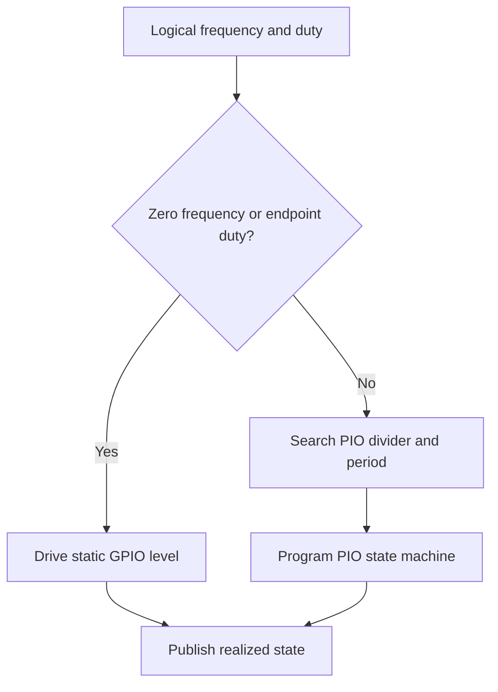

# PIO PWM Generator Design

The PIO generator produces continuous PWM output using one PIO state machine
per configured channel. Source files:

- `firmware/src/pwmdriver/generator/pio_generator.c`
- `firmware/src/pwmdriver/generator/pio_generator.h`
- `firmware/src/pwmdriver/generator/pio_generator.pio`

## Resource Constraints

The PIO generator is limited by the two PIO blocks and their state machines.
The default profile uses eight channels, four per PIO block. A custom profile
must ensure that each channel has a valid PIO state machine and routable GPIO.
Generator and monitor channels must not claim the same PIO resource.

The PIO timing divider and period counter quantize the realized frequency, so
the applied frequency may differ from the requested frequency. The profile's
current target range is about `1 Hz .. 1 MHz`.

## Operation

The compact PIO program loads a period count and duty threshold, loops
continuously, and drives the side-set output. C code selects timing values,
handles static output cases, and publishes realized frequency, duty, and pulse
state through `pwmdriver`.

The public policy is:

- `freq_hz = 0`, `duty = 100`: static high
- `freq_hz = 0`, other duty: static low
- nonzero frequency with `duty = 0` or `100`: static output level

See [PWM Driver Design](../pwm_driver_design.md) for profile routing and
mailbox ownership.
