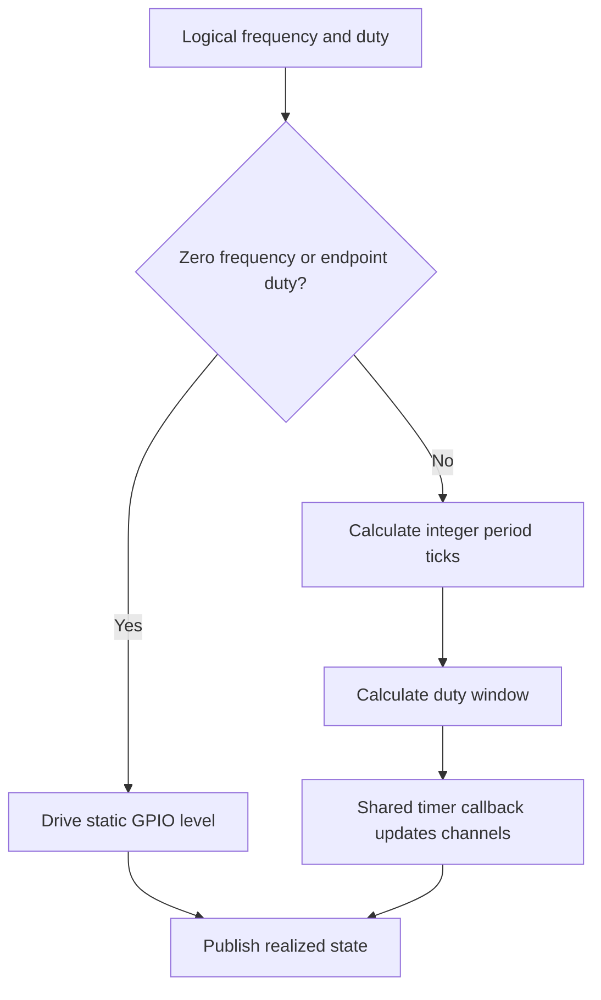

# Software PWM Generator Design

The software generator produces PWM through one shared repeating timer and a
per-channel scheduler state. Source files:

- `firmware/src/pwmdriver/generator/software_generator.c`
- `firmware/src/pwmdriver/generator/software_generator.h`

## Resource Constraints

Software generation does not require a fixed PWM slice or PIO state machine.
A profile may assign valid, uniquely owned GPIOs to software channels, but the
practical channel count is limited by Core 1 CPU time, timer callback work,
and interrupt load.

The current scheduler tick is `10 us`, producing a `100 kHz` base tick. The
recommended generator range is about `1 Hz .. 1 kHz`; period and duty are
quantized to integer scheduler ticks.

## Operation

The shared callback visits active software channels, advances their counters,
and updates GPIO outputs. Static output cases bypass the scheduled path:

- `freq_hz = 0`, `duty = 100`: static high
- `freq_hz = 0`, other duty: static low
- nonzero frequency with `duty = 0` or `100`: static output level

Software generation is intentionally the simple, low-frequency backend. Use
hardware PWM or PIO for tighter timing accuracy or higher-frequency output.
