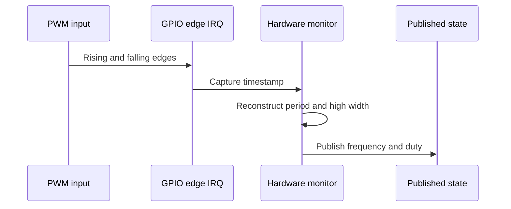

# Hardware PWM Monitor Design

The hardware monitor measures PWM input edges on GPIOs using interrupts and
microsecond timestamps. Source files:

- `firmware/src/pwmdriver/monitor/hardware_monitor.c`
- `firmware/src/pwmdriver/monitor/hardware_monitor.h`

## Constraints

This is a low-frequency, best-effort monitor. It uses one software GPIO
interrupt per edge and reconstructs a sample from one high width and one full
period. Accuracy is affected by interrupt latency and timestamp granularity.
It is not intended for serious kHz-to-MHz measurement.

Use the PIO monitor for higher-rate measurement or when more repeatable timing
is required. The default profile uses the same eight slice-B GPIOs as the
hardware generator, but a profile owns the input direction and pin assignment.

## Measurement Flow

If no transition is observed for more than one second, the monitor publishes
`freq_hz = 0` with duty `0` or `100` for a static low or high input. Its pulse
count represents accepted reconstructed periods, not hardware-counted edges.
