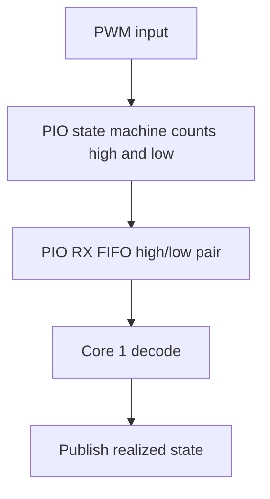

# PIO PWM Monitor Design

The PIO monitor measures PWM input using one state machine per configured
channel and direct high/low FIFO capture. Source files:

- `firmware/src/pwmdriver/monitor/pio_monitor.c`
- `firmware/src/pwmdriver/monitor/pio_monitor.h`
- `firmware/src/pwmdriver/monitor/pio_monitor.pio`

## Constraints

PIO monitoring consumes finite PIO state machines and is capped at 8 channels
total, four per PIO block. The default profile fixes these to the same 8
companion slice-A GPIOs used by the PIO generator; this is one fixed pin set,
not a free choice among routable GPIOs. A custom profile must avoid resource
and GPIO conflicts.

Each read captures one complete high/low period. The PIO program then enters a
capture-complete loop, so no additional periods accumulate in the FIFO before
Core 1 reads the pair and stops the state machine. Intermediate periods and
waveform history are discarded. This backend reports approximate frequency and
duty without allocating DMA channels.

This is deliberate. The product needs an occasional latest reading rather than
continuous high-rate change tracking or a measurement history. Continuous DMA
capture would preserve no additional user-visible information because the
driver would still publish only one current sample. It would instead require
DMA allocation, buffer-coherence rules, and transfer recovery. PIO direct FIFO
capture keeps the timing accuracy of PIO with fewer runtime resources and a
smaller failure surface.

GPIO edge interrupts remain the simpler choice for the slower hardware and
software monitor banks. CPU polling was not selected because it wastes Core 1
time, while PWM-slice capture would tie measurement to the fixed PWM slice
routing. A buffered DMA design can be introduced later if continuous capture
or trend analysis becomes a real requirement.

## Measurement Flow

Invalid samples use the documented sentinel state. Static-level fallback is
applied after the configured one-second capture timeout.
