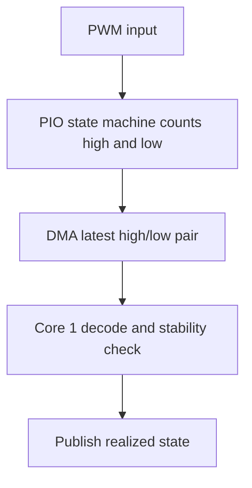

# PIO PWM Monitor Design

The PIO monitor measures PWM input using one state machine per configured
channel and DMA-backed high/low snapshots. Source files:

- `firmware/src/pwmdriver/monitor/pio_monitor.c`
- `firmware/src/pwmdriver/monitor/pio_monitor.h`
- `firmware/src/pwmdriver/monitor/pio_monitor.pio`

## Constraints

PIO monitoring consumes finite PIO state machines and is capped at 8 channels
total, four per PIO block. The default profile fixes these to the same 8
companion slice-A GPIOs used by the PIO generator; this is one fixed pin set,
not a free choice among routable GPIOs. A custom profile must avoid resource
and GPIO conflicts.

The monitor keeps only the latest two-word high/low pair. Intermediate periods
can be discarded, reads use a best-effort stability check, and the finite DMA
transfer eventually exhausts in the current implementation. This backend is
intended for higher-performance monitoring than software polling, but it still
reports approximate frequency and duty.

## Measurement Flow

Unstable samples use the documented sentinel state. Static-level fallback is
applied after the configured inactivity timeout while DMA remains active.
