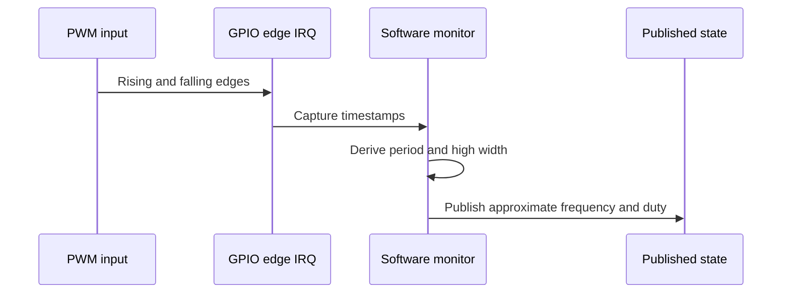

# Software PWM Monitor Design

The software monitor observes input GPIO edges using a shared software monitor
pattern and microsecond timestamps. Source files:

- `firmware/src/pwmdriver/monitor/software_monitor.c`
- `firmware/src/pwmdriver/monitor/software_monitor.h`

## Constraints

Software monitoring has no fixed PWM slice or PIO state-machine allocation and
can use valid, uniquely owned GPIOs. Its practical limits are the shared
scheduler, CPU time, interrupt load, and timestamp granularity.

This is the simple low-frequency monitor. Use PIO or hardware monitoring for
high-frequency or high-accuracy measurement. The current working range is
about `1 Hz .. 1 kHz`, subject to the selected profile's limits.

## Measurement Flow

If no transition is observed for more than one second, the monitor publishes a
static level with `freq_hz = 0` and duty `0` or `100`.
