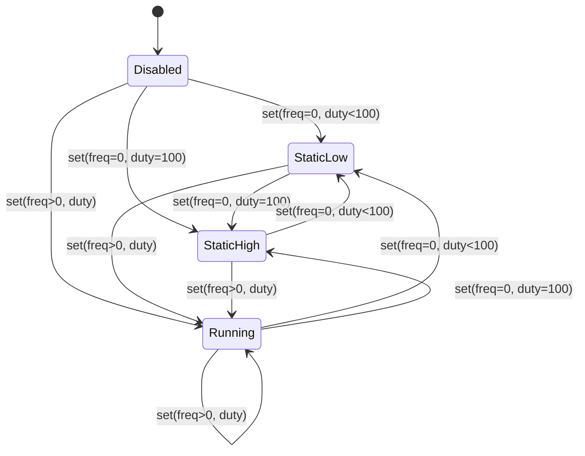
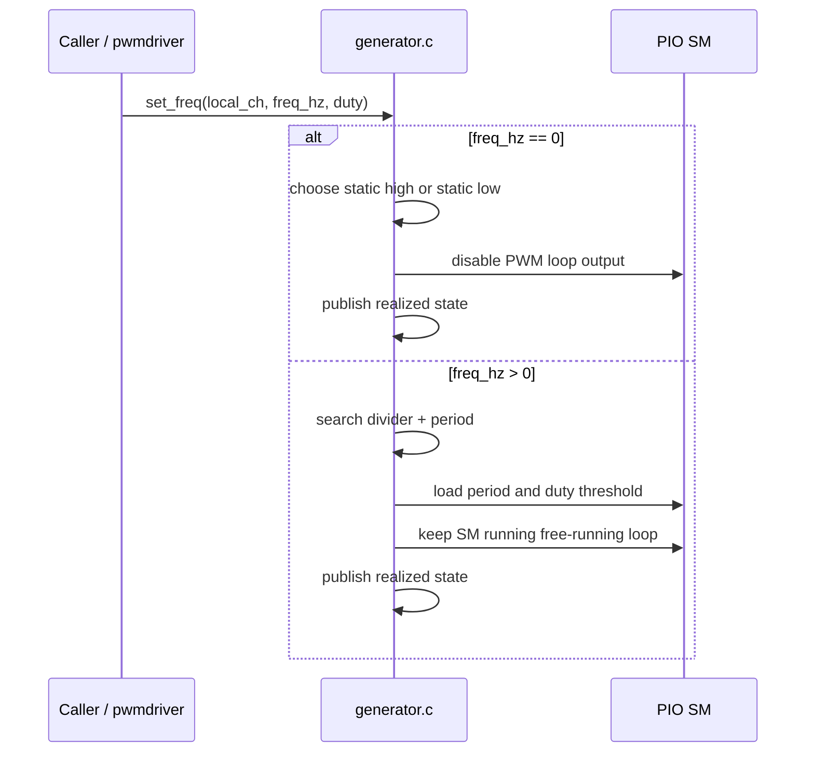
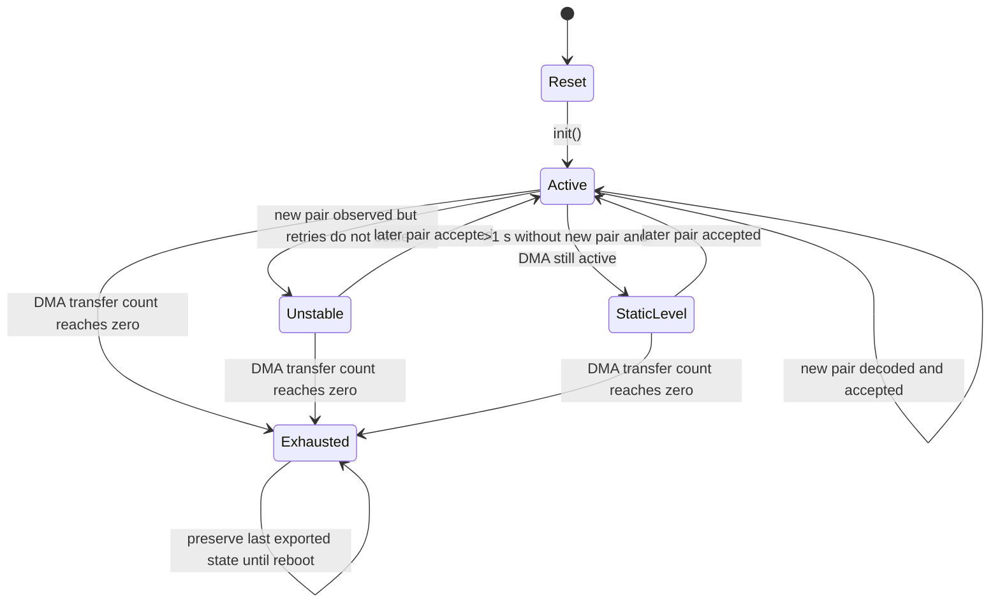
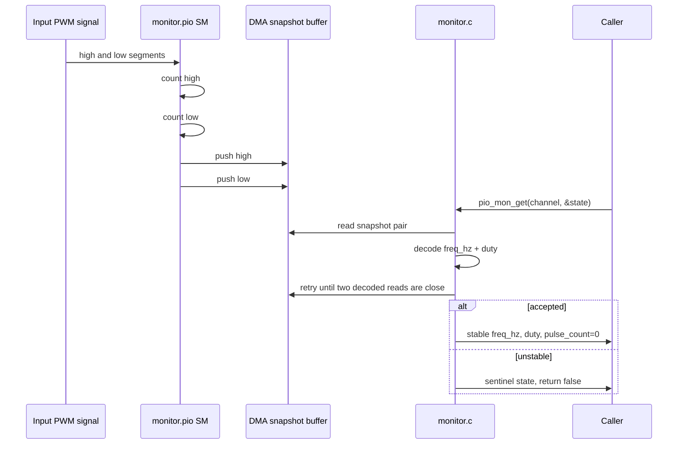

# PIO PWM Detailed Design

This document describes the current PIO-based PWM design used by PicoPWM.

The scope of this page is limited to the PIO-backed PWM implementations under `firmware/src/pwmdriver/pio/`:

- the PIO PWM generator backend
- the standalone PIO PWM monitor backend prototype

This page is implementation-oriented and reflects the current source tree.

## Goals

The PIO PWM design serves two different use cases:

1. generate PWM over the intended PIO channel range
2. monitor PWM on the same physical pin bank used by the PIO generator layout

The design intentionally favors small, understandable PIO programs over feature-heavy state machines.

## Source Layout

| File | Responsibility |
|------|----------------|
| `firmware/src/pwmdriver/pio/generator.c` | PIO PWM generator backend implementation |
| `firmware/src/pwmdriver/pio/generator.h` | PIO PWM generator backend interface |
| `firmware/src/pwmdriver/pio/generator.pio` | PIO assembly program for PWM generation |
| `firmware/src/pwmdriver/pio/monitor.c` | Standalone PIO PWM monitor prototype |
| `firmware/src/pwmdriver/pio/monitor.h` | Standalone PIO PWM monitor interface |
| `firmware/src/pwmdriver/pio/monitor.pio` | PIO assembly program for PWM monitoring |

## Channel and Pin Model

The PIO PWM bank uses logical channels `8..15` in the unified driver model.

Those channels map to these GPIOs:

| Logical Channel | Backend-local Channel | GPIO |
|-----------------|-----------------------|------|
| 8 | 0 | 0 |
| 9 | 1 | 2 |
| 10 | 2 | 4 |
| 11 | 3 | 6 |
| 12 | 4 | 8 |
| 13 | 5 | 10 |
| 14 | 6 | 12 |
| 15 | 7 | 14 |

The monitor prototype reuses that same physical pin order so generator-oriented and monitor-oriented firmware can share harness wiring.

## Generator Design

### Intent

The generator backend provides a flexible PWM engine across the intended PIO range of about `1 Hz .. 1 MHz`.

The public logical state uses:

- `freq_hz` as `uint32_t`
- `duty` as integer percent `0..100`
- `pulse_count` as a backend-published counter in the unified driver model

### PIO Program Shape

The generator program is intentionally small.

It loads:

- a period count into `x`
- a duty threshold into `isr`

At runtime it:

1. copies the duty threshold into `y`
2. counts one period using `y--`
3. drives the side-set output high only while the loop index is still inside the duty window
4. restarts continuously

That keeps the state machine compact and leaves timing search and realized-state policy in C.

### Generator Timing Model

The C backend is responsible for:

- selecting divider and period values that best approximate the requested `freq_hz`
- publishing realized frequency and duty back through the unified driver state
- handling the static output cases for `freq_hz = 0`

The zero-frequency policy is:

- `freq_hz = 0`, `duty = 100` means static high
- `freq_hz = 0`, any other duty means static low

Nonzero-frequency endpoint duties also resolve directly to static levels:

- `duty = 0` means static low
- `duty = 100` means static high

This keeps the public policy aligned with the monitor-oriented interpretation of static levels.

### Generator Tradeoffs

The generator path intentionally prefers:

- a compact PIO program
- integer Hz and integer duty inputs
- realized-state reporting in C

over:

- exact analytical timing in the state machine
- large PIO-side feature sets
- extra hardware-side bookkeeping

### Generator State Machine

The generator backend has a small logical state machine around requested frequency and duty handling.

### Generator Update Sequence

This sequence shows the current control flow when the PIO generator backend applies a logical channel update.

### Generator Workflow

The current generator workflow is:

1. accept one logical request in integer `freq_hz` and integer duty percent
2. resolve static outputs first for `freq_hz = 0` and endpoint duties
3. otherwise search for a divider and period that best approximate the request
4. push timing values into the running PIO state machine
5. publish realized frequency and duty through the backend state

## Monitor Design

### Intent

The monitor backend is a standalone prototype that measures PWM on the PIO pin bank and reports:

- approximate `freq_hz`
- approximate `duty`

It is intentionally not integrated into `pwm_driver.c` yet.

### PIO Program Shape

The monitor PIO program measures one full period in two phases:

1. wait for low
2. wait for rising edge
3. count the high segment
4. store the high count in `y`
5. count the low segment
6. push saved high count
7. push low count
8. restart for the next period

The important design choice is that the state machine does not push the high count immediately when the high segment ends. It waits until both segments are measured and then pushes the pair back-to-back. That reduces the long gap between the two words seen by DMA.

### Monitor DMA Model

The monitor uses a very small latest-snapshot model:

- DMA drains the PIO RX FIFO into a 2-word circular buffer
- the buffer always represents the latest observed `high, low` pair
- intermediate periods are intentionally discarded when software does not read often enough

This is not a history buffer and not a framed stream decoder.

### Monitor Read Acceptance Policy

The C backend applies a best-effort acceptance policy:

1. read one raw pair from the DMA snapshot buffer
2. decode that raw pair into approximate `freq_hz` and `duty`
3. retry up to five times
4. accept the sample when two decoded results are close enough
5. otherwise publish a defined unstable sentinel state

The current closeness policy is:

- frequency delta within `max(1 Hz, 1%)`
- duty delta within `1%`

The unstable sentinel state is:

- `freq_hz = 0x0fffffff`
- `duty = 0`

The helper macro `PIO_MON_IS_UNSTABLE(state)` exists so callers do not need to duplicate the sentinel check.

### Monitor Static-Level Policy

If no new DMA-backed observation arrives for more than one second, the monitor treats the input as out of spec for PWM measurement and publishes:

- `freq_hz = 0`
- `duty = 0` for static low
- `duty = 100` for static high

This static-level timeout is host-side policy in C, not a PIO-side timeout engine.

### Monitor Pulse Count Policy

The monitor backend does not provide a reliable received pulse count.

For that reason it always reports:

- `pulse_count = 0`

This is intentional and documented in the interface contract.

### Monitor Lifetime Policy

The monitor does not try to be a permanent self-rearming DMA stream.

Instead:

- DMA is configured as one long-running finite transfer
- the state machine keeps running continuously
- the backend does not rearm DMA from the measurement fast path

This is an intentional prototype boundary, not an incidental limitation. The monitor treats the
finite DMA lifetime as part of its current behavior so the runtime remains a small latest-snapshot
design instead of also carrying a rearm or stream-management layer.

With the current transfer count, updates eventually stop after about 36 minutes at a `1 MHz` input.

Because monitor initialization is one-shot, that exhausted state persists until reboot.

After DMA exhaustion:

- the backend preserves the last exported state
- the one-second static-level fallback is no longer applied

### Monitor Coherence Model

The monitor path is intentionally best-effort rather than strictly coherent.

The accepted design assumptions are:

- DMA is usually ahead of CPU observation in the normal case
- accepted samples require two similar decoded reads
- residual torn-pair risk is low enough to ignore for this prototype

This is a pragmatic monitoring path, not a strict publication protocol.

If future requirements demand stronger guarantees, the likely upgrade path is:

- explicit publication sequencing
- ping-pong buffers
- or a framed stream design

### Monitor State Machine

The monitor backend has a small logical lifecycle around startup, active sampling, unstable acceptance, static fallback, and finite DMA exhaustion.

### Monitor Measurement Sequence

This sequence shows how one accepted monitor read flows through the current best-effort snapshot design.

### Monitor Workflows

#### Normal Sampling Workflow

1. the PIO state machine measures one full high-plus-low period
2. DMA overwrites the 2-word latest-snapshot buffer
3. software reads the latest pair only when a caller asks for state
4. software retries and compares decoded values
5. software publishes either a stable sample or the unstable sentinel

#### Static-Level Workflow

1. no new DMA-backed pair arrives for more than one second
2. the backend samples the GPIO level directly
3. the backend publishes `freq_hz = 0`
4. the backend publishes duty `0` or `100`

This workflow is only active while DMA is still running.

#### DMA Exhaustion Workflow

1. the long-running DMA transfer eventually reaches zero remaining count
2. the backend stops receiving new measurement pairs
3. the backend preserves the last exported state
4. the backend no longer applies the one-second static fallback
5. that exhausted state persists until reboot because monitor initialization is one-shot

## Generator vs Monitor Summary

| Property | Generator | Monitor |
|----------|-----------|---------|
| Role | Produce PWM | Measure PWM |
| PIO output | side-set output pin | input edge measurement |
| PIO sample model | free-running period loop | full-period high/low pair |
| State publication | realized state in backend C | latest best-effort sample in backend C |
| Static handling | `freq_hz = 0` drives static level | 1-second inactivity maps to static level |
| Pulse count | supported by unified backend model | intentionally unsupported, always `0` |
| Lifetime | normal runtime backend | finite DMA snapshot prototype |

## Design Positioning

The current PIO PWM design intentionally chooses:

- small state machines
- explicit documented limitations
- best-effort monitor semantics
- minimal backend state

instead of:

- large PIO-side feature sets
- strict stream coherence machinery
- permanent self-healing monitor runtime
- protocol-heavy measurement buffering

That tradeoff keeps the current implementation easier to reason about and aligned with the stated prototype goals.
