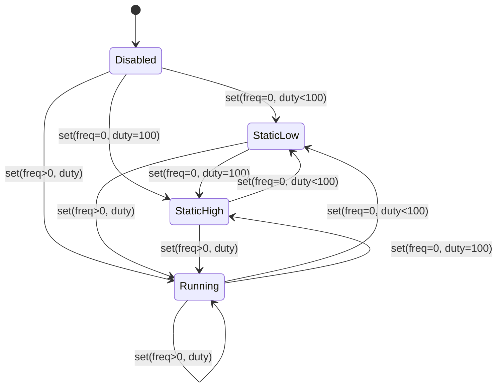
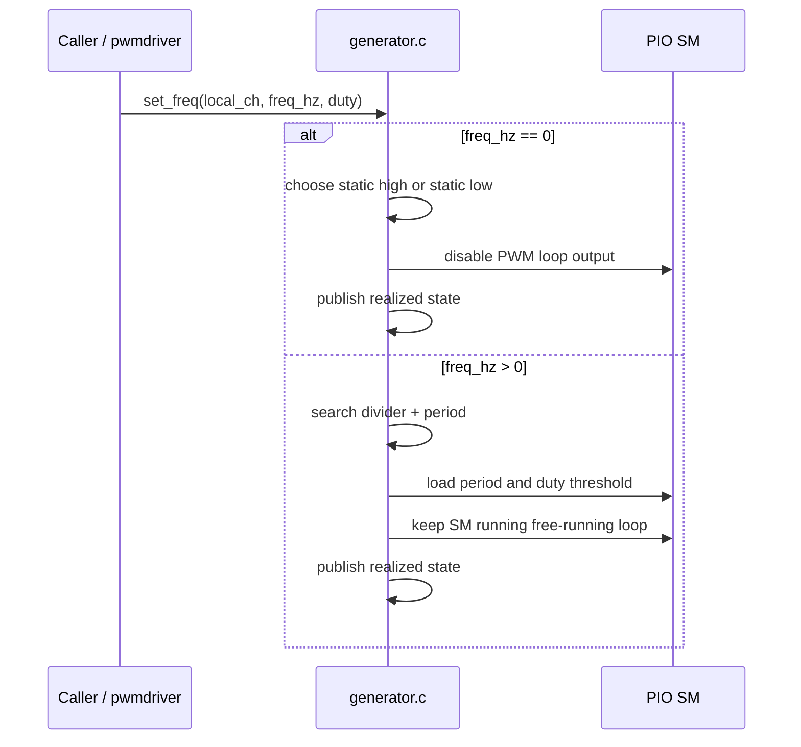
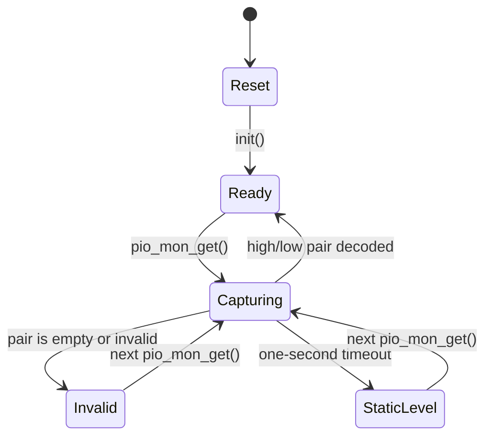
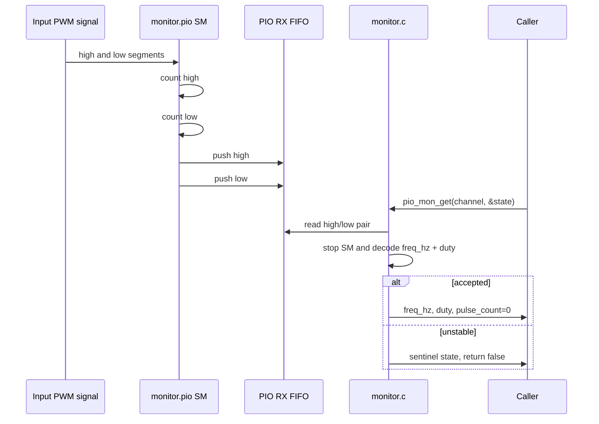

# PIO PWM Detailed Design

This document describes the current PIO-based PWM design used by PicoPWM.

The scope of this page is limited to the PIO-backed PWM implementations under `firmware/src/pwmdriver/pio/`:

- the PIO PWM generator backend
- the standalone PIO PWM monitor backend prototype

This page is implementation-oriented and reflects the current source tree.

## Goals

The PIO PWM design serves two different use cases:

1. generate PWM over the intended PIO channel range
2. monitor PWM on the same physical pin bank used by the PIO generator layout

The design intentionally favors small, understandable PIO programs over feature-heavy state machines.

## Monitor Architecture Decision

The PIO monitor is designed to answer an occasional request for the current
frequency and duty cycle. It is not a waveform recorder, trend detector, or
high-rate change tracker. One complete PWM period is therefore sufficient for
the product contract.

The selected design starts one PIO state machine capture, measures one
high/low period, pushes exactly two FIFO words, and enters a stopped capture
loop. Core 1 reads the pair and disables the state machine. This keeps timing
work in PIO while preventing additional periods from accumulating in the FIFO,
avoiding a DMA channel and a continuous software stream-management path.

The alternatives were considered as follows:

| Design | Consideration | Decision |
|--------|---------------|----------|
| CPU GPIO polling | Lowest hardware complexity, but consumes CPU time and becomes unreliable at higher frequencies. | Not selected for PIO monitoring. |
| GPIO edge interrupts | Simple and effective for slow signals, but interrupt latency limits higher-rate accuracy. | Used by hardware/software monitor banks. |
| PIO one-period capture | Measures a complete period in hardware, emits exactly two FIFO words, and matches latest-value reads. | Selected. |
| PIO continuous capture with DMA | Good for continuous high-rate streams and history, but unnecessary when only one latest result is retained; adds DMA allocation, coherence, and lifetime handling. | Rejected for current requirements. |
| PWM-slice input capture | Efficient hardware timing, but couples monitoring to PWM slice/channel routing and weakens the fixed bank model. | Rejected. |

DMA should be reconsidered only if the requirements expand to continuous
sampling, waveform history, trend analysis, or guaranteed capture while Core 1
is busy with other work. The current design deliberately rejects FIFO
accumulation rather than accepting possible overrun at high frequencies.

## Source Layout

| File | Responsibility |
|------|----------------|
| `firmware/src/pwmdriver/pio/generator.c` | PIO PWM generator backend implementation |
| `firmware/src/pwmdriver/pio/generator.h` | PIO PWM generator backend interface |
| `firmware/src/pwmdriver/pio/generator.pio` | PIO assembly program for PWM generation |
| `firmware/src/pwmdriver/pio/monitor.c` | Standalone PIO PWM monitor prototype |
| `firmware/src/pwmdriver/pio/monitor.h` | Standalone PIO PWM monitor interface |
| `firmware/src/pwmdriver/pio/monitor.pio` | PIO assembly program for PWM monitoring |

## Channel and Pin Model

The PIO PWM bank uses logical channels `8..15` in the unified driver model.

Those channels map to these GPIOs:

| Logical Channel | Backend-local Channel | GPIO |
|-----------------|-----------------------|------|
| 8 | 0 | 0 |
| 9 | 1 | 2 |
| 10 | 2 | 4 |
| 11 | 3 | 6 |
| 12 | 4 | 8 |
| 13 | 5 | 10 |
| 14 | 6 | 12 |
| 15 | 7 | 14 |

The monitor prototype reuses that same physical pin order so generator-oriented and monitor-oriented firmware can share harness wiring.

## Generator Design

### Intent

The generator backend provides a flexible PWM engine across the intended PIO range of about `1 Hz .. 1 MHz`.

The public logical state uses:

- `freq_hz` as `uint32_t`
- `duty` as integer percent `0..100`
- `pulse_count` as a backend-published counter in the unified driver model

### PIO Program Shape

The generator program is intentionally small.

It loads:

- a period count into `x`
- a duty threshold into `isr`

At runtime it:

1. copies the duty threshold into `y`
2. counts one period using `y--`
3. drives the side-set output high only while the loop index is still inside the duty window
4. restarts continuously

That keeps the state machine compact and leaves timing search and realized-state policy in C.

### Generator Timing Model

The C backend is responsible for:

- selecting divider and period values that best approximate the requested `freq_hz`
- publishing realized frequency and duty back through the unified driver state
- handling the static output cases for `freq_hz = 0`

The zero-frequency policy is:

- `freq_hz = 0`, `duty = 100` means static high
- `freq_hz = 0`, any other duty means static low

Nonzero-frequency endpoint duties also resolve directly to static levels:

- `duty = 0` means static low
- `duty = 100` means static high

This keeps the public policy aligned with the monitor-oriented interpretation of static levels.

### Generator Tradeoffs

The generator path intentionally prefers:

- a compact PIO program
- integer Hz and integer duty inputs
- realized-state reporting in C

over:

- exact analytical timing in the state machine
- large PIO-side feature sets
- extra hardware-side bookkeeping

### Generator State Machine

The generator backend has a small logical state machine around requested frequency and duty handling.

```mermaid
stateDiagram-v2
	[*] --> Disabled
	Disabled --> StaticLow: set(freq=0, duty<100)
	Disabled --> StaticHigh: set(freq=0, duty=100)
	Disabled --> Running: set(freq>0, duty)
	StaticLow --> StaticHigh: set(freq=0, duty=100)
	StaticLow --> Running: set(freq>0, duty)
	StaticHigh --> StaticLow: set(freq=0, duty<100)
	StaticHigh --> Running: set(freq>0, duty)
	Running --> StaticLow: set(freq=0, duty<100)
	Running --> StaticHigh: set(freq=0, duty=100)
	Running --> Running: set(freq>0, duty)
```

### Generator Update Sequence

This sequence shows the current control flow when the PIO generator backend applies a logical channel update.

```mermaid
sequenceDiagram
	participant Caller as Caller / pwmdriver
	participant Gen as generator.c
	participant PIO as PIO SM

	Caller->>Gen: set_freq(local_ch, freq_hz, duty)
	alt freq_hz == 0
		Gen->>Gen: choose static high or static low
		Gen->>PIO: disable PWM loop output
		Gen->>Gen: publish realized state
	else freq_hz > 0
		Gen->>Gen: search divider + period
		Gen->>PIO: load period and duty threshold
		Gen->>PIO: keep SM running free-running loop
		Gen->>Gen: publish realized state
	end
```

### Generator Workflow

The current generator workflow is:

1. accept one logical request in integer `freq_hz` and integer duty percent
2. resolve static outputs first for `freq_hz = 0` and endpoint duties
3. otherwise search for a divider and period that best approximate the request
4. push timing values into the running PIO state machine
5. publish realized frequency and duty through the backend state

## Monitor Design

### Intent

The monitor backend is a standalone prototype that measures PWM on the PIO pin bank and reports:

- approximate `freq_hz`
- approximate `duty`

It is intentionally not integrated into `pwm_driver.c` yet.

### PIO Program Shape

The monitor PIO program measures one full period in two phases:

1. wait for low
2. wait for rising edge
3. count the high segment
4. store the high count in `y`
5. count the low segment
6. push saved high count
7. push low count
8. restart for the next period

The important design choice is that the state machine does not push the high count immediately when the high segment ends. It waits until both segments are measured and then pushes the pair back-to-back. The driver consumes those two words directly from the RX FIFO.

### Monitor Capture Model

The monitor uses a one-period, read-driven model:

- a channel read starts one PIO state-machine capture
- the PIO program measures one complete `high, low` period and then stops
- Core 1 reads the two FIFO words directly and stops the state machine
- intermediate periods and waveform history are intentionally discarded
- a capture that does not complete within one second is reported as a static level

This is not a continuous stream, history buffer, or trend decoder. It also avoids allocating a
DMA channel for each PIO monitor channel.

### Monitor Read Acceptance Policy

The C backend applies a direct capture policy:

1. start the PIO state machine with an empty RX FIFO
2. poll until two FIFO words are available or the one-second timeout expires
3. stop the state machine and read the high/low pair
4. decode that pair into approximate `freq_hz` and `duty`
5. publish the decoded sample or a defined unstable sentinel state

The unstable sentinel state is:

- `freq_hz = 0x0fffffff`
- `duty = 0`

The helper macro `PIO_MON_IS_UNSTABLE(state)` exists so callers do not need to duplicate the sentinel check.

### Monitor Static-Level Policy

If no complete pair arrives within one second of capture start, the monitor treats the input as out of spec for PWM measurement and publishes:

- `freq_hz = 0`
- `duty = 0` for static low
- `duty = 100` for static high

This static-level timeout is host-side policy in C, not a PIO-side timeout engine.

### Monitor Pulse Count Policy

The monitor backend does not provide a reliable received pulse count.

For that reason it always reports:

- `pulse_count = 0`

This is intentional and documented in the interface contract.

### Monitor Lifetime Policy

The monitor starts and stops the PIO state machine for each requested sample. It does not retain
waveform history or rearm a continuous capture stream. The PIO program enters a self-loop after
the two pushes, so only one complete pair can reach the FIFO during a capture. This makes the
FIFO behavior bounded and avoids accepting stale pairs from previous periods.

### Monitor State Machine

The monitor backend has a small logical lifecycle around startup, one-period capture, invalid samples, and static fallback.

```mermaid
stateDiagram-v2
	[*] --> Reset
	Reset --> Ready: init()
	Ready --> Capturing: pio_mon_get()
	Capturing --> Ready: high/low pair decoded
	Capturing --> Invalid: pair is empty or invalid
	Invalid --> Capturing: next pio_mon_get()
	Capturing --> StaticLevel: one-second timeout
	StaticLevel --> Capturing: next pio_mon_get()
```

### Monitor Measurement Sequence

This sequence shows how one monitor read flows through the one-period capture design.

```mermaid
sequenceDiagram
	participant Sig as Input PWM signal
	participant SM as monitor.pio SM
	participant FIFO as PIO RX FIFO
	participant Mon as monitor.c
	participant Caller as Caller

	Sig->>SM: high and low segments
	SM->>SM: count high
	SM->>SM: count low
	SM->>FIFO: push high
	SM->>FIFO: push low
	Caller->>Mon: pio_mon_get(channel, &state)
	Mon->>FIFO: read high/low pair
	Mon->>Mon: stop SM and decode freq_hz + duty
	alt accepted
		Mon->>Caller: freq_hz, duty, pulse_count=0
	else unstable
		Mon->>Caller: sentinel state, return false
	end
```

### Monitor Workflows

#### Normal Sampling Workflow

1. a caller asks for state
2. the PIO state machine starts and measures one full high-plus-low period
3. Core 1 reads the two FIFO words and stops the state machine
4. software decodes the pair
5. software publishes either the sample or the unstable sentinel

#### Static-Level Workflow

1. no complete pair arrives within one second of capture start
2. the backend samples the GPIO level directly
3. the backend publishes `freq_hz = 0`
4. the backend publishes duty `0` or `100`

## Generator vs Monitor Summary

| Property | Generator | Monitor |
|----------|-----------|---------|
| Role | Produce PWM | Measure PWM |
| PIO output | side-set output pin | input edge measurement |
| PIO sample model | free-running period loop | full-period high/low pair |
| State publication | realized state in backend C | latest best-effort sample in backend C |
| Static handling | `freq_hz = 0` drives static level | 1-second inactivity maps to static level |
| Pulse count | supported by unified backend model | intentionally unsupported, always `0` |
| Lifetime | normal runtime backend | one-period capture per read |

## Design Positioning

The current PIO PWM design intentionally chooses:

- small state machines
- explicit documented limitations
- best-effort monitor semantics
- minimal backend state

instead of:

- large PIO-side feature sets
- strict stream coherence machinery
- permanent self-healing monitor runtime
- protocol-heavy measurement buffering

That tradeoff keeps the current implementation easier to reason about and aligned with the stated prototype goals.
