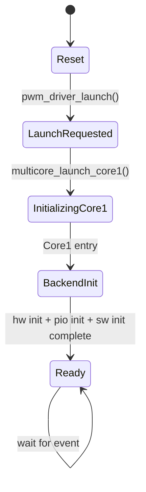
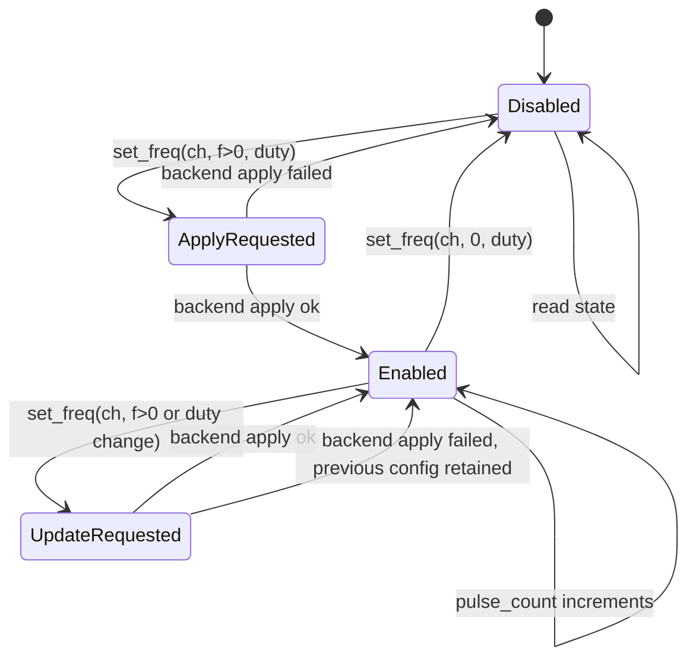
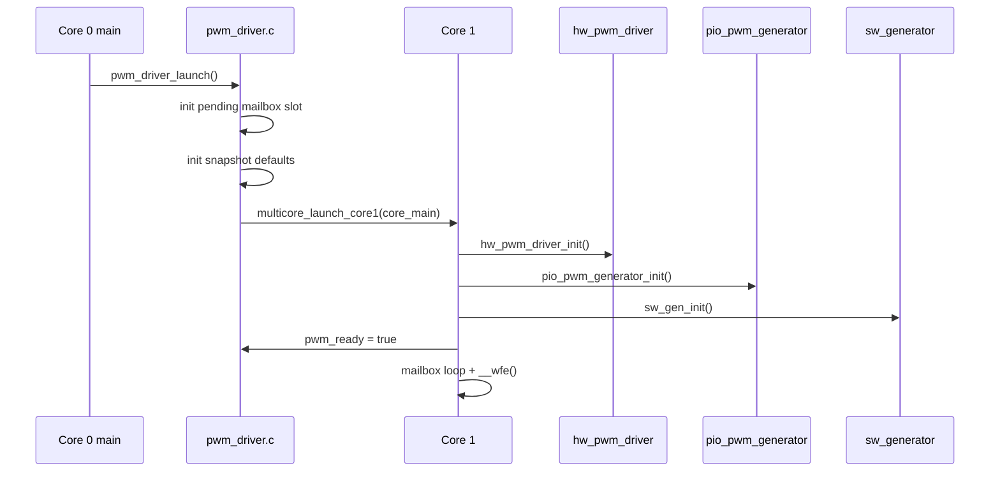
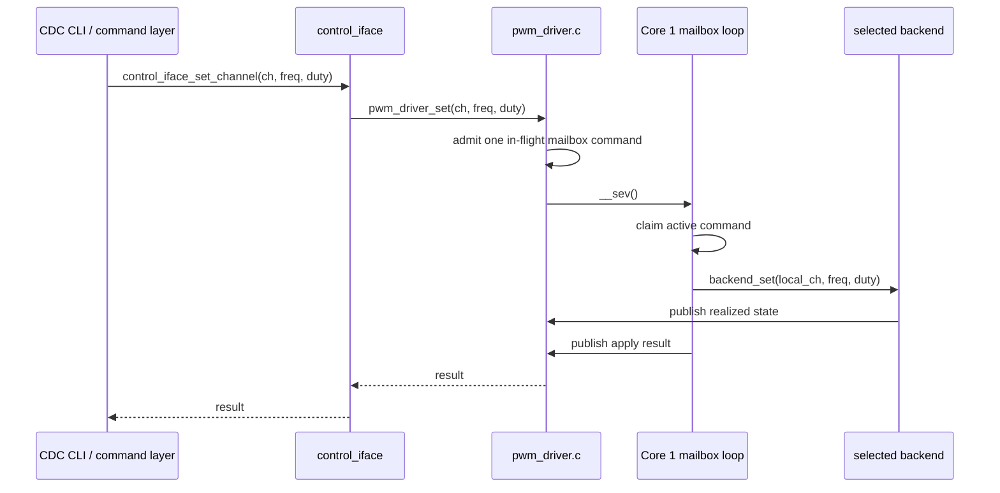
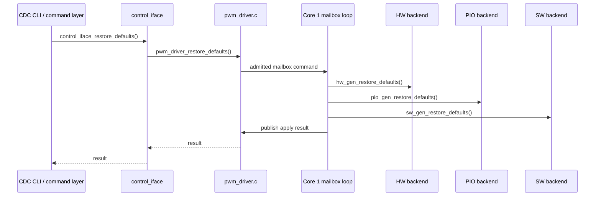
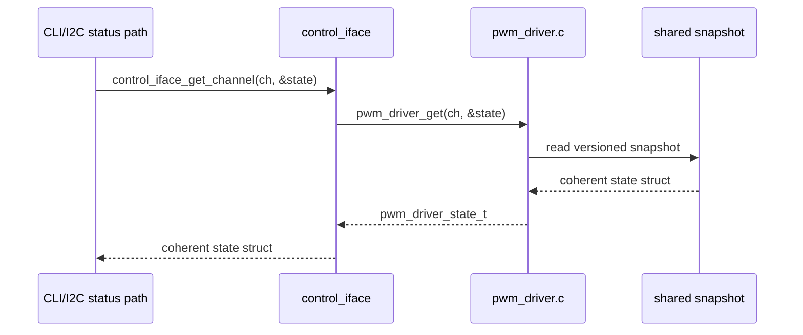

# PWM Driver Detailed Design

This document describes the detailed design of the `pwmdriver` subsystem in the current PicoPWM firmware.

The focus of this page is:

- subsystem responsibilities
- cross-core separation
- mailbox and snapshot behavior
- state machines
- API call sequences
- detailed behavior of each PWM backend

This document is implementation-oriented and follows the current firmware under `firmware/src/pwmdriver/`.

## Scope

The `pwmdriver` subsystem provides one logical PWM service for 24 channels:

- `0..7` hardware PWM
- `8..15` PIO PWM
- `16..23` software PWM

It is responsible for:

- owning all PWM backend state on Core 1
- translating logical channel IDs to backend-local channel IDs
- accepting command-path frequency and duty updates from Core 0
- publishing realized channel state for readback
- hiding backend-specific timing details from higher layers

It is not responsible for:

- parsing CLI commands
- I2C transport framing
- user-facing validation policy beyond basic driver-side checks

## Design Goals

The subsystem is designed around the following goals:

1. Keep communication and user interface handling on Core 0.
2. Keep PWM timing engines, IRQs, and backend state on Core 1.
3. Expose one logical channel model to higher layers.
4. Separate command submission from backend implementation details.
5. Publish realized state rather than maintaining a second shadow model in a separate control layer.

## Source Layout

The current implementation is split as follows:

| File | Responsibility |
|------|----------------|
| `firmware/src/control/control_iface.h` | Shared Core 0 control/status API used by CDC and I2C |
| `firmware/src/control/control_iface.c` | Shared device info, channel reads, and channel write helpers above `pwmdriver` |
| `firmware/src/i2c/i2c_control_map.h` | I2C register map definitions and protocol helpers |
| `firmware/src/i2c/i2c_control_map.c` | I2C register encode/decode and deferred write translation into `control_iface` |
| `firmware/src/pwmdriver/pwm_driver.h` | Public wrapper API and logical channel constants |
| `firmware/src/pwmdriver/pwm_driver.c` | Core 1 launch, mailbox loop, channel routing, shared snapshot |
| `firmware/src/pwmdriver/hw/generator.c` | Hardware PWM generator backend |
| `firmware/src/pwmdriver/hw/monitor.c` | Standalone hardware PWM monitor prototype |
| `firmware/src/pwmdriver/pio/generator.c` | PIO generator backend |
| `firmware/src/pwmdriver/pio/generator.pio` | PIO assembly program used by the PIO generator backend |
| `firmware/src/pwmdriver/sw/generator.c` | Software PWM generator backend |
| `firmware/src/pwmdriver/sw/monitor.c` | Standalone software PWM monitor prototype |

## External Interface

The transport-facing control/status layer is:

```c
const char *control_iface_device_name(void);
const char *control_iface_firmware_version(void);
uint8_t control_iface_channel_count(void);
bool control_iface_get_channel(uint channel, pwm_driver_state_t *state);
pwm_driver_result_t control_iface_set_channel(uint channel, uint32_t freq_hz, uint8_t duty);
pwm_driver_result_t control_iface_restore_defaults(void);
```

Below that, `pwmdriver` owns the internal cross-core mailbox boundary used by `control_iface`:

```c
void pwm_driver_launch(void);
bool pwm_driver_is_ready(void);
```

The internal Core 0 control layer uses the following mailbox API:

```c
pwm_driver_result_t pwm_driver_set(uint channel, uint32_t freq_hz, uint8_t duty);
bool pwm_driver_get(uint channel, pwm_driver_state_t *state);
pwm_driver_result_t pwm_driver_restore_defaults(void);
```

The shared state type is:

```c
typedef struct {
    uint32_t freq_hz;
    uint8_t duty;
    uint32_t pulse_count;
} pwm_driver_state_t;
```

### API Intent

Architecturally, `pwm_driver_set()` is an internal command-ingress API.

- Top-level command paths such as the CDC CLI and I2C register map should enter through `control_iface`.
- The I2C write path should continue to defer out of the ISR before it reaches this mailbox API.
- It is not intended as a general-purpose helper for arbitrary internal call sites.
- Core 1 callers must not use this API; it returns `PWM_DRIVER_RESULT_UNAVAILABLE` outside the Core 0 command path.
- Public write callers first pass through the shared Core 0 serialization lock before they compete for mailbox admission.
- Core 0 waits for Core 1 to finish the backend apply step before returning.
- The wrapper returns `PWM_DRIVER_RESULT_BUSY` if the caller reaches the mailbox while another write is already pending or in progress.
- The wrapper returns `PWM_DRIVER_RESULT_INVALID` for invalid channel or unsupported frequency requests.
- The wrapper returns `PWM_DRIVER_RESULT_UNAVAILABLE` if Core 1 is not ready yet.
- The wrapper returns `PWM_DRIVER_RESULT_TIMEOUT` if Core 1 does not publish a reply before the apply timeout. This timeout does not cancel the admitted command, so the final hardware outcome is unknown until the caller reads back state.
- The wrapper returns `PWM_DRIVER_RESULT_APPLY_FAILED` if Core 1 accepts the command but the backend rejects it.
- `pwm_driver_restore_defaults()` uses the same mailbox path but applies one bulk restore-defaults command on Core 1 instead of 24 separate round trips.

## Logical Channel Mapping

| Logical Channel | Backend | Backend-local Channel | GPIO |
|-----------------|---------|-----------------------|------|
| `0..7` | HW PWM | `0..7` | `1,3,5,7,9,11,13,15` |
| `8..15` | PIO PWM | `0..7` | `0,2,4,6,8,10,12,14` |
| `16..23` | SW PWM | `0..7` | `18,19,20,21,22,25,26,27` |

The hardware bank uses PWM slice channel B pins intentionally so the pinout remains compatible with measurement-oriented or monitoring-oriented firmware that expects identical physical channel positions.

## Internal Separation

The subsystem has four internal layers.

### 1. Transport Layer

Owned by the CDC CLI and I2C transport modules.

Responsibilities:

- parse transport-specific requests
- format transport-specific responses
- avoid backend access and multicore synchronization details

For I2C specifically, the transport layer includes an ISR-facing slave module and a register-map helper that translates binary registers into shared control-layer operations.

### 2. Shared Control Layer

Owned by `firmware/src/control/control_iface.c`.

Responsibilities:

- expose one shared Core 0 control/status API to both transports
- centralize device identity and version reporting
- centralize logical channel reads and writes above `pwmdriver`
- avoid maintaining a second shadow copy of realized channel state

This layer reads realized state from `pwm_driver_get()` and forwards writes through the internal `pwmdriver` mailbox API.

It does not own I2C register numbers or binary payload layout. Those protocol details live in `firmware/src/i2c/i2c_control_map.c`.

### 3. Wrapper Layer

Owned by `pwm_driver.c`.

Responsibilities:

- serialize public write entry points on Core 0
- own mailbox admission and reply waiting for the internal `pwm_driver_set()` and `pwm_driver_restore_defaults()` APIs

This layer does not know backend-specific register or timing details.

This layer is the architectural boundary between the shared Core 0 control plane and backend-specific code.

### 4. Backend Layer

Owned by:

- `hw/generator.c`
- `pio/generator.c`
- `sw/generator.c`

Standalone monitor prototypes currently live beside that integrated backend set under:

- `hw/monitor.c`
- `pio/monitor.c`
- `sw/monitor.c`

Responsibilities:

- own backend timing configuration
- own backend-local state
- manage backend IRQ or timer behavior
- publish realized state after successful changes

### 5. Hardware/Runtime Layer

Owned by the Pico SDK and the MCU peripherals.

Resources used:

- PWM slices
- GPIO edge IRQs for the standalone hardware monitor prototype
- PIO programs, state machines, and IRQs
- repeating timer callback for software PWM
- multicore event signaling

## Core Ownership Model

### Core 0

Core 0 owns:

- USB CDC transport
- I2C slave transport
- CLI command parsing and formatting
- shared control/status translation
- status formatting and reporting

Core 0 reads channel state through `pwm_driver_get()`.

### Core 1

Core 1 owns:

- all PWM backend initialization
- all backend-local timing configuration
- all PWM-related IRQ handling
- the software PWM timer callback
- shared snapshot publication

Core 0 must not call backend driver functions directly.

## High-Level State Machine

The `pwmdriver` wrapper has a small lifecycle state machine.



### State Descriptions

| State | Meaning |
|------|---------|
| `Reset` | Static memory and snapshot defaults only |
| `LaunchRequested` | Core 0 requested Core 1 startup |
| `BackendInit` | Core 1 is initializing all backends |
| `Ready` | Mailbox processing and PWM service active |

## Per-Channel Operational State Machine

Each logical channel behaves like this from the wrapper point of view.



This is a logical model. Backend-specific internal state differs by driver.

## API Sequence Diagrams

### `pwm_driver_launch()`



### `control_iface_set_channel()` to `pwm_driver_set()`



### `control_iface_restore_defaults()` to `pwm_driver_restore_defaults()`



### Read Path



The coherent higher-layer read boundary is `control_iface_get_channel()`, which forwards one channel snapshot from `pwm_driver_get()`.

## Wrapper Layer Detailed Design

## Mailbox Command Structure

The wrapper uses one single-slot mailbox record containing:

- operation kind
- logical channel for set-channel commands
- requested frequency for set-channel commands
- requested duty for set-channel commands

Only one command is admitted at a time. If a second writer arrives while the slot is pending or executing, the wrapper returns `PWM_DRIVER_RESULT_BUSY` immediately.

The slot also carries a small lifecycle state enum:

- `IDLE`
- `PENDING`
- `ACTIVE`
- `COMPLETE`

This replaces separate pending, active, and reply-ready booleans and keeps the single-slot mailbox easier to reason about.

The mailbox state, command payload, and reply payload now live together in one small mailbox struct rather than as separate globals.

### Responsibilities of `pwm_driver.c`

`pwm_driver.c` performs the following functions.

1. Channel class detection.
2. Small range-based channel classification from logical channel number to backend-local index.
3. Core 1 launch and ready-state control.
4. Mailbox state transitions for the one-slot Core 0/Core 1 command exchange.
5. Reply publication for the active Core 0 command.
6. Shared-state publication.
7. Readback through a versioned snapshot.

### Logical Routing

Routing is done by a small fixed channel classifier:

- hardware bank: logical channels `0..7`
- PIO bank: logical channels `8..15`
- software bank: logical channels `16..23`

Each descriptor owns:

- backend `set()` callback
- backend-native `restore_defaults()` callback
- optional backend-owned readback finalizer

### Shared Snapshot Design

Each logical channel has a published record containing:

- version
- `freq_hz`
- `duty`
- `pulse_count`

Per-channel readback metadata lives beside that common snapshot cache rather than inside every channel record:

- `pulse_ref_us` for each logical channel

Backends may optionally finalize readback from that metadata after the coherent snapshot copy. The
current PIO generator uses this hook to extrapolate its running `pulse_count` on Core 0 without
teaching the wrapper which backend owns that policy.

The writer increments `version` before and after update.

Reader behavior:

1. Read `version_before`.
2. If odd, retry.
3. Copy data fields.
4. Read `version_after`.
5. Accept only if versions match and are even.

This provides a lock-free coherent snapshot read on Core 0.

## Hardware PWM Summary

The hardware PWM implementation is now split into:

- `firmware/src/pwmdriver/hw/generator.c` for the integrated generator backend
- `firmware/src/pwmdriver/hw/monitor.c` for the standalone monitor prototype

The integrated generator backend:

- accepts integer `freq_hz` and integer duty percent
- uses one PWM slice per logical hardware channel
- treats `freq_hz = 0` as a static-output policy case
- publishes realized `freq_hz` and `duty`
- always publishes `pulse_count = 0`
- does not keep a separate backend-local realized-state cache now that the shared snapshot is the only external read model

The current hardware generator no longer uses a wrap IRQ for pulse counting.

The standalone hardware monitor prototype:

- observes the same GPIO bank with one edge interrupt per transition
- reconstructs frequency and duty from microsecond timestamps
- is intentionally low-frequency and best-effort only
- increments `pulse_count` once per completed observed period

For the current hardware timing equations, counter-width limits, divider limits, and the recommended operating range, see [Hardware PWM Design](hw_pwm_design.md).

## Software PWM Summary

The software PWM implementation is now split into:

- `firmware/src/pwmdriver/sw/generator.c` for the integrated generator backend
- `firmware/src/pwmdriver/sw/monitor.c` for the standalone monitor prototype

The integrated generator backend:

- accepts integer `freq_hz` and integer duty percent
- uses one shared software scheduler tick for the software channel bank
- treats `freq_hz = 0` and endpoint duties as static-output policy cases
- publishes realized `freq_hz`, `duty`, and generated `pulse_count`
- owns the software-PWM maximum frequency policy directly in the backend

The standalone software monitor prototype:

- observes the same GPIO bank with one edge interrupt per transition
- reconstructs frequency and duty from microsecond timestamps
- is intentionally low-frequency and best-effort only
- increments `pulse_count` once per completed observed period
- is intentionally standalone and not yet integrated with the software generator ownership model

For the current software timing model, target range, and standalone monitor role, see [Software PWM Design](sw_pwm_design.md).

## PIO Generator Detailed Design

### Purpose

The PIO backend provides better timing quality than software PWM without consuming the dedicated hardware PWM slice bank.

### Resource Allocation

- 8 logical channels
- distributed over `pio0` and `pio1`
- 4 state machines on each PIO block
- one output pin per state machine
- no per-period IRQ or DMA path in the current generator implementation

### Channel Distribution

| Local Channel | PIO | State Machine | GPIO |
|---------------|-----|---------------|------|
| 0 | `pio0` | 0 | 0 |
| 1 | `pio0` | 1 | 2 |
| 2 | `pio0` | 2 | 4 |
| 3 | `pio0` | 3 | 6 |
| 4 | `pio1` | 0 | 8 |
| 5 | `pio1` | 1 | 10 |
| 6 | `pio1` | 2 | 12 |
| 7 | `pio1` | 3 | 14 |

### PIO Program Role

The PIO program:

1. loads a duty level and a period value
2. compares the running counter against the desired level
3. drives the side-set output high or low
4. loops with the period cached in `ISR` until the channel is reconfigured

### Initialization

Initialization steps:

1. load the PIO program into each used PIO block once
2. assign each logical channel to one PIO block and one state machine
3. initialize output GPIO low
4. initialize per-channel cached timing state

### Timing Search

The PIO driver computes timing by searching `period_count` and deriving a quantized `clkdiv`.

In steady state, one PWM period costs:

$$
cycles\_per\_period = 3 \times (period\_count + 1) + 2
$$

The `+2` term comes from the `mov y, isr` reload and the `jmp restart` at the end of each period. The two initial `pull` instructions are startup cost only and are not part of steady-state frequency calculation.

For each candidate `period_count`:

1. compute cycles per period used by the program
2. derive the ideal divider from system clock and target frequency
3. quantize divider to PIO fractional precision
4. compute realized frequency
5. track the minimum error solution

The driver rejects requests that cannot be represented within PIO period and divider constraints.

The current generator firmware also rejects requests above `1 MHz` so the backend behavior stays aligned with the documented intended operating range.

### Enable Sequence

When enabling or updating a channel, the backend first resolves one target mode:

- static low
- static high
- running PWM

Then one internal apply helper performs the full transition for that resolved mode:

1. synchronize the cached pulse counter to the current time
2. either drive a static SIO level or program and enable the PIO state machine
3. publish the resulting realized mode/timing snapshot

### Disable Sequence

There is no separate disable-only apply path now. A disable or endpoint-duty request is handled by
resolving one static target mode and applying it through the same internal helper used by PWM-mode
updates.

### Pulse Counting

The PIO backend does not count pulses with a per-period interrupt.

Instead it:

1. stores the last synchronized `pulse_count`
2. stores the timestamp when that count was synchronized
3. accumulates additional pulses from elapsed time and realized frequency on update/read boundaries
4. publishes a refreshed snapshot when configuration changes

For PIO channels, `pulse_count` is therefore an estimated period count, not a hardware-observed edge count.

When a nonzero-frequency request resolves to `0%` or `100%` duty, the backend treats that as a
static mode and publishes `realized_freq_hz = 0`. From that point `pulse_count` stops advancing
until the channel returns to running PWM mode. Consumers that need true edge counting must still
not treat the PIO backend's `pulse_count` as a physical pin toggle count.

## Software PWM Driver Detailed Design

### Purpose

The software PWM backend provides the lowest-cost implementation for slower frequencies.

### Resource Allocation

- 8 output GPIOs
- one repeating timer callback
- one per-channel runtime struct

### Timing Base

- timer period: `10 us`
- base rate: `100000 Hz`

Requested frequency is converted to a period measured in timer ticks.

$$
period\_ticks \approx \frac{100000}{f_{req}}
$$

Realized frequency becomes:

$$
f_{real} = \frac{100000}{period\_ticks}
$$

### Channel Runtime State

Each software channel stores:

- GPIO number
- `period_ticks`
- `duty_ticks`
- running counter
- pulse counter

Channel activity is tracked separately by the backend-wide `sw_pwm_active_mask` rather than by a
per-channel active field.

### Initialization

For each channel:

1. assign GPIO
2. clear period and duty tick values
3. clear counter and pulse counter
4. leave the channel out of the active mask
5. initialize GPIO as output low

After channel setup:

1. start one repeating timer at `10 us`

### Set-Frequency Behavior

When applying a new configuration:

1. clamp duty to `0.0..1.0`
2. if `freq_hz <= 0`, remove the channel from the active mask and drive a static level
3. otherwise compute `period_ticks`
4. compute `duty_ticks`
5. compute realized frequency
6. protect shared channel timing fields with interrupt masking
7. write timing fields and realized state
8. reset the per-channel running counter
9. add the channel to the active mask
10. publish realized state before releasing the interrupt-masked section

### Timer Callback Behavior

On every timer tick:

1. iterate through all software channels
2. skip inactive channels
3. increment running counter
4. when counter reaches period, reset counter and increment pulse count
5. publish pulse count update
6. drive GPIO high while `counter < duty_ticks`, otherwise low

### Concurrency Handling

The timer callback and set-frequency path both touch channel timing fields.

Protection method:

- `save_and_disable_interrupts()` before update
- write timing fields and update the active-mask membership
- publish the coherent realized snapshot while the scheduler cannot run
- `restore_interrupts()` after update

This keeps the callback from observing partially updated configuration.

## Snapshot Publication Model

Backends publish state through three helper functions in `pwm_driver.c`.

### `pwm_driver_store_applied_state()`

Used after a successful apply of:

- new frequency
- new duty
- disable request

Published fields:

- realized `freq_hz`
- realized `duty`
- current `pulse_count`

### `pwm_driver_store_applied_state_coherent()`

Used when a backend already owns an interrupt-excluded coherent update boundary and wants to avoid
re-entering another interrupt-masked region just to publish the snapshot.

Published fields:

- realized `freq_hz`
- realized `duty`
- current `pulse_count`

### `pwm_driver_store_pulse_count()`

Used by:

- software PWM timer callback

Only the `pulse_count` field is updated for these events.

## Readback Semantics

The architectural intent is that the `pwmdriver` snapshot is the single source of truth for logical channel state.

Important readback properties:

- values are realized backend values, not merely requested values
- `pulse_count` is monotonic from power-on
- `stop` disables output but does not reset counters
- callers should prefer a single state-struct read when they need coherent multi-field data

## Failure and Boundary Conditions

### Common Wrapper-Level Rejections

The wrapper rejects:

- invalid channel index
- unsupported mailbox operation kind

### Backend-Level Rejections

Hardware PWM may reject invalid channel numbers.

PIO PWM may reject frequencies that cannot be represented by the program timing search.

Software PWM owns its own maximum supported frequency policy and resolves static outputs to the
driven realized level in published state.

Launch-time cache seeding uses the same shared logical default as backend restore-defaults:

- `freq_hz = 0`
- `duty = 0`
- `pulse_count = 0`

### Mailbox Pressure

The wrapper accepts one in-flight mailbox command at a time.

If another write is already pending or executing on Core 1 when a caller reaches the mailbox admission point, that write attempt gets `PWM_DRIVER_RESULT_BUSY`.

The public write layer also keeps a small Core 0 mutex around the write entry points so only one mailbox submission path can compete for the single-slot command record at a time.

After admission, the caller waits synchronously for the Core 1 reply, but only up to the apply timeout. If Core 1 does not publish a reply in time, the wrapper returns `PWM_DRIVER_RESULT_TIMEOUT`. That timeout does not cancel the already admitted command, so higher layers must treat the final apply result as unknown until they read back state.

Restore-defaults uses the same mailbox path, but Core 1 now fans out through backend-native reset helpers rather than re-entering the normal per-channel public setter path.

## Design Constraints and Assumptions

The current design assumes:

1. Core 0 is the normal producer of `pwm_driver_set()` and `pwm_driver_restore_defaults()` requests through `control_iface`.
2. Backend drivers remain Core 1 implementation details.
3. CDC CLI and I2C both use the same shared Core 0 control facade.
4. The shared snapshot is the only read model exposed upward.

I2C writes should continue to defer out of ISR context before they enter `control_iface` and the internal `pwmdriver` mailbox boundary.

## Summary

The `pwmdriver` subsystem is a logical-channel wrapper around three different PWM timing engines.

Its main value is not the backends themselves, but the separation it enforces:

- Core 0 handles user-facing command and status paths.
- Core 1 owns timing, hardware state, and backend implementation details.
- One logical API and one realized-state snapshot are shared upward.

This allows higher layers to think in terms of logical channels while still using the best available timing engine per channel class.