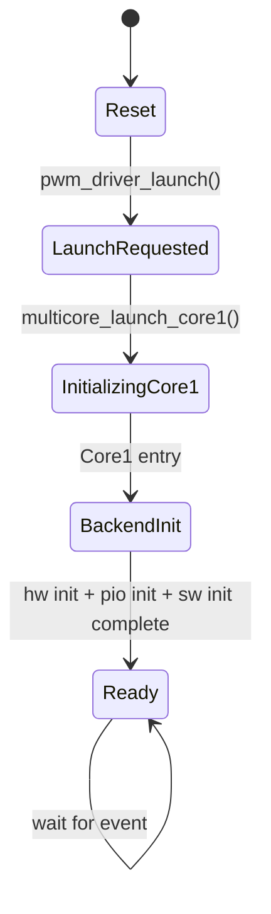
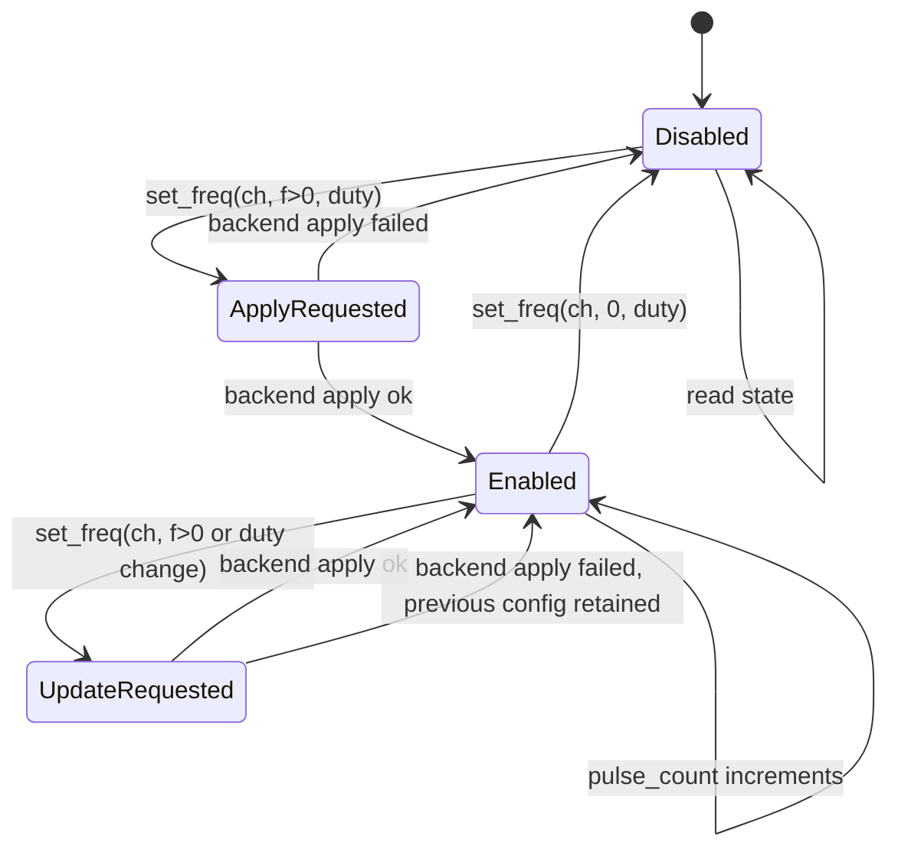
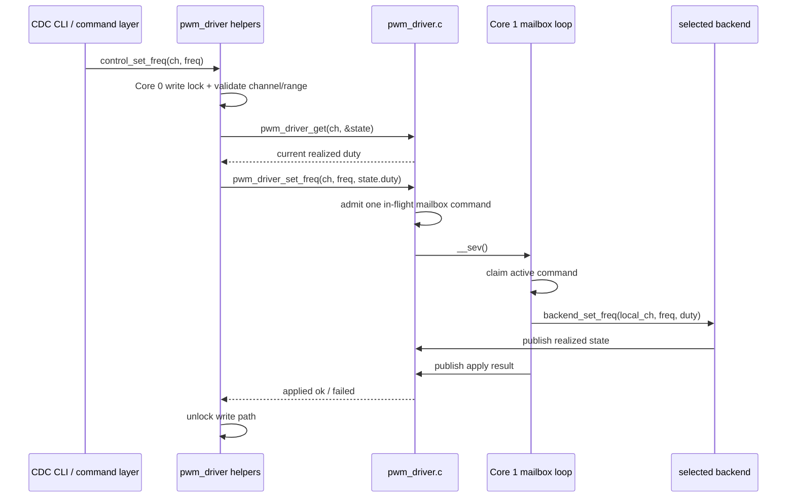
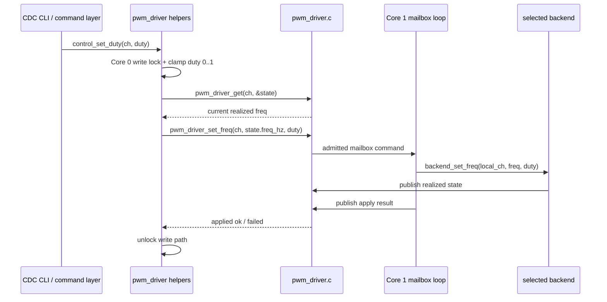
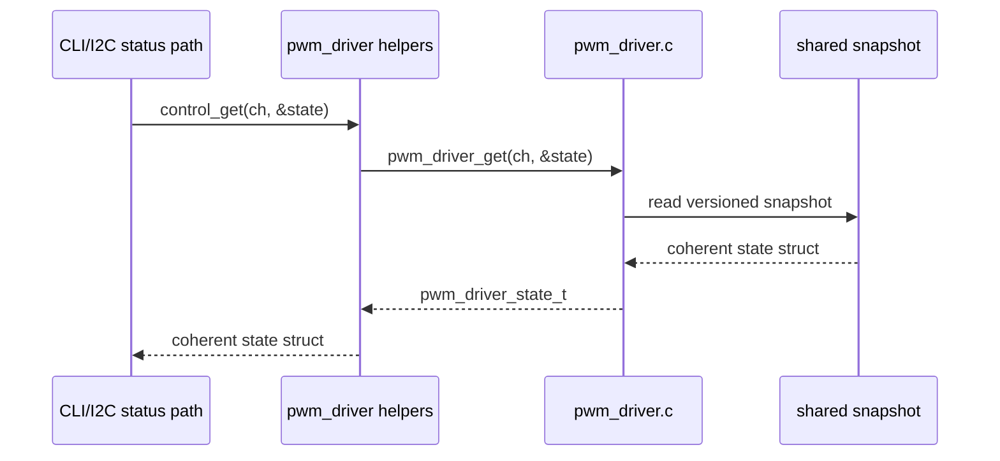

# PWM Driver Detailed Design

This document describes the detailed design of the `pwmdriver` subsystem in the current PicoPWM firmware.

The focus of this page is:

- subsystem responsibilities
- cross-core separation
- mailbox and snapshot behavior
- state machines
- API call sequences
- detailed behavior of each PWM backend

This document is implementation-oriented and follows the current firmware under `firmware/src/pwmdriver/`.

## Scope

The `pwmdriver` subsystem provides one logical PWM service for 24 channels:

- `0..7` hardware PWM
- `8..15` PIO PWM
- `16..23` software PWM

It is responsible for:

- owning all PWM backend state on Core 1
- translating logical channel IDs to backend-local channel IDs
- accepting command-path frequency and duty updates from Core 0
- publishing realized channel state for readback
- hiding backend-specific timing details from higher layers

It is not responsible for:

- parsing CLI commands
- I2C transport framing
- user-facing validation policy beyond basic driver-side checks

## Design Goals

The subsystem is designed around the following goals:

1. Keep communication and user interface handling on Core 0.
2. Keep PWM timing engines, IRQs, and backend state on Core 1.
3. Expose one logical channel model to higher layers.
4. Separate command submission from backend implementation details.
5. Publish realized state rather than maintaining a second shadow model in a separate control layer.

## Source Layout

The current implementation is split as follows:

| File | Responsibility |
|------|----------------|
| `firmware/src/control/control_iface.h` | Shared Core 0 control/status API used by CDC and I2C |
| `firmware/src/control/control_iface.c` | Shared device info, channel reads, and channel write helpers above `pwmdriver` |
| `firmware/src/i2c/i2c_control_map.h` | I2C register map definitions and protocol helpers |
| `firmware/src/i2c/i2c_control_map.c` | I2C register encode/decode and deferred write translation into `control_iface` |
| `firmware/src/pwmdriver/pwm_driver.h` | Public wrapper API and logical channel constants |
| `firmware/src/pwmdriver/pwm_driver.c` | Core 1 launch, mailbox loop, channel routing, shared snapshot |
| `firmware/src/pwmdriver/hw_pwm_driver.c` | Hardware PWM backend |
| `firmware/src/pwmdriver/pio_pwm_driver.c` | PIO PWM backend |
| `firmware/src/pwmdriver/pio_pwm_driver.pio` | PIO assembly program used by the PIO backend |
| `firmware/src/pwmdriver/sw_pwm_driver.c` | Software PWM backend |

## External Interface

The transport-facing control/status layer is:

```c
const char *control_iface_device_name(void);
const char *control_iface_firmware_version(void);
uint8_t control_iface_channel_count(void);
bool control_iface_get_channel(uint channel, pwm_driver_state_t *state);
pwm_driver_result_t control_iface_set_channel(uint channel, float freq_hz, float duty);
pwm_driver_result_t control_iface_set_channel_freq(uint channel, float freq_hz);
pwm_driver_result_t control_iface_set_channel_duty(uint channel, float duty);
pwm_driver_result_t control_iface_stop_all(void);
```

Below that, the `pwmdriver` wrapper still exposes the cross-core boundary:

The higher layers use the following public API:

```c
void pwm_driver_launch(void);
bool pwm_driver_is_ready(void);
pwm_driver_result_t pwm_driver_set_freq(uint channel, float freq_hz, float duty);
bool pwm_driver_get(uint channel, pwm_driver_state_t *state);
```

The shared state type is:

```c
typedef struct {
    float freq_hz;
    float duty;
    uint32_t pulse_count;
} pwm_driver_state_t;
```

### API Intent

Architecturally, `pwm_driver_set_freq()` is a command-ingress API.

- It is intended to be called from top-level command paths such as the CDC CLI.
- If a future I2C write command path is added, it should defer out of the ISR and use the high-level `control_*()` helpers on Core 0.
- It is not intended as a general-purpose helper for arbitrary internal call sites.
- Higher command layers should prefer `control_set()` for full-state writes instead of calling `pwm_driver_set_freq()` directly.
- Core 1 callers must not use this API; it returns `PWM_DRIVER_RESULT_UNAVAILABLE` outside the Core 0 command path.
- Public write callers first pass through the shared Core 0 serialization lock before they compete for mailbox admission.
- Core 0 waits for Core 1 to finish the backend apply step before returning.
- The wrapper returns `PWM_DRIVER_RESULT_BUSY` if the caller reaches the mailbox while another write is already pending or in progress.
- The wrapper returns `PWM_DRIVER_RESULT_INVALID` for invalid channel or non-finite input.
- The wrapper returns `PWM_DRIVER_RESULT_UNAVAILABLE` if Core 1 is not ready yet.
- The wrapper returns `PWM_DRIVER_RESULT_TIMEOUT` if Core 1 does not publish a reply before the apply timeout. This timeout does not cancel the admitted command, so the final hardware outcome is unknown until the caller reads back state.
- The wrapper returns `PWM_DRIVER_RESULT_APPLY_FAILED` if Core 1 accepts the command but the backend rejects it.

## Logical Channel Mapping

| Logical Channel | Backend | Backend-local Channel | GPIO |
|-----------------|---------|-----------------------|------|
| `0..7` | HW PWM | `0..7` | `1,3,5,7,9,11,13,15` |
| `8..15` | PIO PWM | `0..7` | `0,2,4,6,8,10,12,14` |
| `16..23` | SW PWM | `0..7` | `18,19,20,21,22,25,26,27` |

The hardware bank uses PWM slice channel B pins intentionally so the pinout remains compatible with measurement-oriented or monitoring-oriented firmware that expects identical physical channel positions.

## Internal Separation

The subsystem has four internal layers.

### 1. Transport Layer

Owned by the CDC CLI and I2C transport modules.

Responsibilities:

- parse transport-specific requests
- format transport-specific responses
- avoid backend access and multicore synchronization details

For I2C specifically, the transport layer includes an ISR-facing slave module and a register-map helper that translates binary registers into shared control-layer operations.

### 2. Shared Control Layer

Owned by `firmware/src/control/control_iface.c`.

Responsibilities:

- expose one shared Core 0 control/status API to both transports
- centralize device identity and version reporting
- centralize logical channel reads and writes above `pwmdriver`
- avoid maintaining a second shadow copy of realized channel state

This layer reads realized state from `pwm_driver_get()` through the `control_*()` helpers and forwards writes through the same shared control path.

It does not own I2C register numbers or binary payload layout. Those protocol details live in `firmware/src/i2c/i2c_control_map.c`.

### 3. Wrapper Layer

Owned by `pwm_driver.c`.

Responsibilities:

- serialize public write entry points on Core 0
- call `pwm_driver_set_freq()`

This layer does not know backend-specific register or timing details.

This layer is the architectural boundary between the shared Core 0 control plane and backend-specific code.

### 4. Backend Layer

Owned by:

- `hw_pwm_driver.c`
- `pio_pwm_driver.c`
- `sw_pwm_driver.c`

Responsibilities:

- own backend timing configuration
- own backend-local state
- manage backend IRQ or timer behavior
- publish realized state after successful changes

### 5. Hardware/Runtime Layer

Owned by the Pico SDK and the MCU peripherals.

Resources used:

- PWM slices and wrap IRQ
- PIO programs, state machines, and IRQs
- repeating timer callback for software PWM
- multicore event signaling

## Core Ownership Model

### Core 0

Core 0 owns:

- USB CDC transport
- I2C slave transport
- CLI command parsing and formatting
- shared control/status translation
- status formatting and reporting

Core 0 reads channel state through `pwm_driver_get()`.

### Core 1

Core 1 owns:

- all PWM backend initialization
- all backend-local timing configuration
- all PWM-related IRQ handling
- the software PWM timer callback
- shared snapshot publication

Core 0 must not call backend driver functions directly.

## High-Level State Machine

The `pwmdriver` wrapper has a small lifecycle state machine.



### State Descriptions

| State | Meaning |
|------|---------|
| `Reset` | Static memory and snapshot defaults only |
| `LaunchRequested` | Core 0 requested Core 1 startup |
| `BackendInit` | Core 1 is initializing all backends |
| `Ready` | Mailbox processing and PWM service active |

## Per-Channel Operational State Machine

Each logical channel behaves like this from the wrapper point of view.



This is a logical model. Backend-specific internal state differs by driver.

## API Sequence Diagrams

### `pwm_driver_launch()`


### `control_set_freq()` to `pwm_driver_set_freq()`

This is the intended top-level write path.



### `control_set_duty()` to `pwm_driver_set_freq()`



### Read Path



The coherent higher-layer read boundary is `control_get()`, which forwards one channel snapshot from `pwm_driver_get()`.

## Wrapper Layer Detailed Design

## Mailbox Command Structure

The wrapper uses one single-slot mailbox record containing:

- logical channel
- requested frequency
- requested duty

Only one command is admitted at a time. If a second writer arrives while the slot is pending or executing, the wrapper returns `PWM_DRIVER_RESULT_BUSY` immediately.

### Responsibilities of `pwm_driver.c`

`pwm_driver.c` performs the following functions.

1. Channel class detection.
2. Conversion from logical channel number to backend-local index.
3. Core 1 launch and ready-state control.
4. Pending-mailbox claim and apply loop.
5. Reply publication for the active Core 0 command.
6. Shared-state publication.
7. Readback through a versioned snapshot.

### Logical Routing

Routing is done by channel range:

- `0..7` -> hardware backend
- `8..15` -> PIO backend
- `16..23` -> software backend

### Shared Snapshot Design

Each logical channel has a published record containing:

- version
- `freq_hz`
- `duty`
- `pulse_count`

The writer increments `version` before and after update.

Reader behavior:

1. Read `version_before`.
2. If odd, retry.
3. Copy data fields.
4. Read `version_after`.
5. Accept only if versions match and are even.

This provides a lock-free coherent snapshot read on Core 0.

## Hardware PWM Driver Detailed Design

### Purpose

The hardware PWM backend provides the highest timing accuracy and the widest practical frequency range.

### Resource Allocation

- 8 PWM slices
- one logical channel per slice
- channel B pins only
- wrap IRQ for pulse counting

### Pin Mapping

| Local Channel | GPIO | Slice | Channel |
|---------------|------|-------|---------|
| 0 | 1 | 0 | B |
| 1 | 3 | 1 | B |
| 2 | 5 | 2 | B |
| 3 | 7 | 3 | B |
| 4 | 9 | 4 | B |
| 5 | 11 | 5 | B |
| 6 | 13 | 6 | B |
| 7 | 15 | 7 | B |

### Initialization

For each channel:

1. set GPIO function to PWM
2. compute slice and channel identity
3. configure default divider and wrap
4. initialize PWM slice
5. force output low and disabled
6. initialize local state arrays

After per-channel setup:

1. enable wrap IRQ on each used slice
2. install a single wrap interrupt handler

### Frequency Programming

Input parameters:

- local channel
- requested frequency
- duty cycle

Behavior:

1. clamp duty into `0.0..1.0`
2. if `freq_hz <= 0`, disable slice and drive output low
3. otherwise iterate over valid integer and fractional divider values
4. compute `TOP` candidate for each divider
5. reject invalid combinations
6. choose the smallest normalized frequency error
7. program wrap, divider, and compare level
8. enable slice
9. publish realized state

Realized frequency equation:

$$
f_{pwm} = \frac{f_{sys}}{clkdiv \cdot (TOP + 1)}
$$

### Duty Conversion

Duty is mapped to compare level using:

$$
level \approx duty \cdot (TOP + 1)
$$

Special cases:

- `duty <= 0` -> level `0`
- `duty >= 1` -> level `TOP + 1`

### Pulse Counting

The wrap IRQ handler:

1. reads IRQ status mask
2. identifies which slice triggered
3. increments that logical channel's pulse counter
4. publishes pulse count to the shared snapshot
5. clears the slice IRQ

## PIO PWM Driver Detailed Design

### Purpose

The PIO backend provides better timing quality than software PWM without consuming the dedicated hardware PWM slice bank.

### Resource Allocation

- 8 logical channels
- distributed over `pio0` and `pio1`
- 4 state machines on each PIO block
- one output pin per state machine
- one interrupt source per state machine for pulse counting

### Channel Distribution

| Local Channel | PIO | State Machine | GPIO |
|---------------|-----|---------------|------|
| 0 | `pio0` | 0 | 0 |
| 1 | `pio0` | 1 | 2 |
| 2 | `pio0` | 2 | 4 |
| 3 | `pio0` | 3 | 6 |
| 4 | `pio1` | 0 | 8 |
| 5 | `pio1` | 1 | 10 |
| 6 | `pio1` | 2 | 12 |
| 7 | `pio1` | 3 | 14 |

### PIO Program Role

The PIO program:

1. loads a period value
2. compares the running counter against the desired level
3. drives the side-set output high or low
4. raises a PIO IRQ at period completion

This IRQ is used for pulse counting, not for waveform generation.

### Initialization

Initialization steps:

1. load the PIO program into each used PIO block once
2. register IRQ handlers for `PIO0_IRQ_0` and `PIO1_IRQ_0`
3. assign each logical channel to one PIO block and one state machine
4. enable interrupt source for the corresponding state machine
5. initialize output GPIO low
6. initialize per-channel cached timing state

### Timing Search

The PIO driver computes timing by searching `period_count` and deriving a quantized `clkdiv`.

For each candidate `period_count`:

1. compute cycles per period used by the program
2. derive the ideal divider from system clock and target frequency
3. quantize divider to PIO fractional precision
4. compute realized frequency
5. track the minimum error solution

The driver rejects requests that cannot be represented within PIO period and divider constraints.

### Enable Sequence

When enabling or updating a channel:

1. stop the state machine
2. clear FIFOs
3. restart the state machine
4. push the new period count
5. load the desired level
6. set the state machine divider
7. clear stale interrupt state
8. enable the state machine
9. publish realized state

### Disable Sequence

When disabling a channel:

1. stop the state machine
2. clear FIFOs
3. clear interrupt state
4. return pin to SIO output mode
5. drive pin low
6. publish realized disabled state

### Pulse Counting

The PIO IRQ handler:

1. identifies which state machine interrupt fired
2. increments the corresponding local pulse counter
3. publishes the new pulse count to the shared snapshot
4. clears the PIO interrupt bit

## Software PWM Driver Detailed Design

### Purpose

The software PWM backend provides the lowest-cost implementation for slower frequencies.

### Resource Allocation

- 8 output GPIOs
- one repeating timer callback
- one per-channel runtime struct

### Timing Base

- timer period: `10 us`
- base rate: `100000 Hz`

Requested frequency is converted to a period measured in timer ticks.

$$
period\_ticks \approx \frac{100000}{f_{req}}
$$

Realized frequency becomes:

$$
f_{real} = \frac{100000}{period\_ticks}
$$

### Channel Runtime State

Each software channel stores:

- GPIO number
- `period_ticks`
- `duty_ticks`
- running counter
- pulse counter
- active flag

### Initialization

For each channel:

1. assign GPIO
2. set default period and duty tick values
3. clear counter and pulse counter
4. mark inactive
5. initialize GPIO as output low

After channel setup:

1. start one repeating timer at `10 us`

### Set-Frequency Behavior

When applying a new configuration:

1. clamp duty to `0.0..1.0`
2. if `freq_hz <= 0`, mark inactive and drive low
3. otherwise compute `period_ticks`
4. compute `duty_ticks`
5. protect shared channel timing fields with interrupt masking
6. reset per-channel running counter
7. mark channel active
8. compute realized frequency
9. publish realized state

### Timer Callback Behavior

On every timer tick:

1. iterate through all software channels
2. skip inactive channels
3. increment running counter
4. when counter reaches period, reset counter and increment pulse count
5. publish pulse count update
6. drive GPIO high while `counter < duty_ticks`, otherwise low

### Concurrency Handling

The timer callback and set-frequency path both touch channel timing fields.

Protection method:

- `save_and_disable_interrupts()` before update
- write timing fields and active flag
- `restore_interrupts()` after update

This keeps the callback from observing partially updated configuration.

## Snapshot Publication Model

Backends publish state through two helper functions in `pwm_driver.c`.

### `pwm_driver_store_applied_state()`

Used after a successful apply of:

- new frequency
- new duty
- disable request

Published fields:

- realized `freq_hz`
- realized `duty`
- current `pulse_count`

### `pwm_driver_store_pulse_count()`

Used by:

- hardware PWM wrap IRQ
- PIO IRQ handlers
- software PWM timer callback

Only the `pulse_count` field is updated for these events.

## Readback Semantics

The architectural intent is that the `pwmdriver` snapshot is the single source of truth for logical channel state.

Important readback properties:

- values are realized backend values, not merely requested values
- `pulse_count` is monotonic from power-on
- `stop` disables output but does not reset counters
- callers should prefer a single state-struct read when they need coherent multi-field data

## Failure and Boundary Conditions

### Common Wrapper-Level Rejections

The wrapper rejects:

- invalid channel index
- non-finite `freq_hz`
- non-finite `duty`

### Backend-Level Rejections

Hardware PWM may reject invalid channel numbers.

PIO PWM may reject frequencies that cannot be represented by the program timing search.

Software PWM may clamp internally to representable tick values, but still treats `freq <= 0` as disable.

### Mailbox Pressure

The wrapper accepts one in-flight mailbox command at a time.

If another write is already pending or executing on Core 1 when a caller reaches the mailbox admission point, that write attempt gets `PWM_DRIVER_RESULT_BUSY`.

The public write layer also keeps a small Core 0 mutex around the write entry points so stale partner fields are not re-submitted when a read-modify-write helper races another writer.

After admission, the caller waits synchronously for the Core 1 reply, but only up to the apply timeout. If Core 1 does not publish a reply in time, the wrapper returns `PWM_DRIVER_RESULT_TIMEOUT`. That timeout does not cancel the already admitted command, so higher layers must treat the final apply result as unknown until they read back state.

## Design Constraints and Assumptions

The current design assumes:

1. Core 0 is the normal producer of `pwm_driver_set_freq()` requests.
2. Backend drivers remain Core 1 implementation details.
3. CDC CLI is the current write-command ingress path.
4. I2C is currently read-only.

If a future I2C write path is added, it should enter through the high-level helpers in `pwm_driver.c` and use the same `pwm_driver_set_freq()` boundary.

## Summary

The `pwmdriver` subsystem is a logical-channel wrapper around three different PWM timing engines.

Its main value is not the backends themselves, but the separation it enforces:

- Core 0 handles user-facing command and status paths.
- Core 1 owns timing, hardware state, and backend implementation details.
- One logical API and one realized-state snapshot are shared upward.

This allows higher layers to think in terms of logical channels while still using the best available timing engine per channel class.